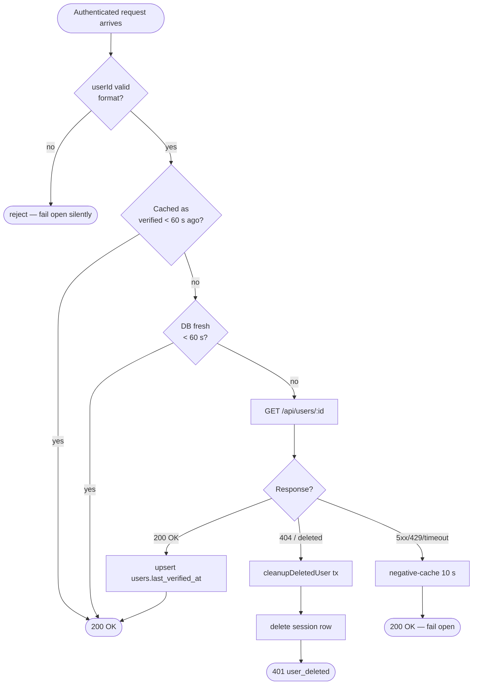

# GDPR hardening — overview

**Status:** Canonical for the template repo. Downstream plugins (applaunchpad,
glossary, audio-hub) inherit on each template sync. See
[Template sync](../guides/template-sync.md).

> **This page is the scan-friendly overview.** Read it top-to-bottom in
> ~5 minutes. For source-level depth (full sequence diagrams, caching
> invariants, threat scenarios, code map) jump to **[GDPR internals](gdpr-internals.md)**.

The narrative is paired with source-of-truth ADRs:

- [ADR-0011 — User cache lifecycle](../adrs/0011-user-cache-lifecycle.md) — eager fill + reconciliation
- [ADR-0012 — Strict-GDPR user lifecycle](../adrs/0012-strict-gdpr-user-lifecycle.md) — per-request + per-render + background
- [ADR-0013 — Logging contract](../adrs/0013-logging-contract.md) — observability for the above
- [Sessions](sessions.md) — cookie-first auth, session lifetime
- [Database](database.md) — `users.last_verified_at` column, FK shape

For log-line meanings + Grafana queries see [Log catalog](../reference/log-catalog.md).

---

## At a glance

**One sentence:** a user deleted in Staffbase loses plugin access within
**60 seconds**, disappears from rendered lists within **5 minutes**, and is
purged from the database **transactionally** — without locking other users
out during Staffbase outages.

### Deletion timeline

What happens from the moment a user is deleted upstream:

```mermaid
%%{init: { 'gantt': { 'leftPadding': 140, 'rightPadding': 30 }, 'themeVariables': { 'fontSize': '13px' } }}%%
gantt
    title "After upstream delete at T+0"
    dateFormat ss
    axisFormat +%S s
    section Access
    Cookie still valid (worst case before hardening) :crit, done, 0, 28800
    Layer 1 gate rejects next request               :active, 0, 60
    section PII in lists
    Name visible until refresh (old behaviour)      :crit, done, 0, 9000
    Layer 2 strips name from next render            :active, 0, 300
    section Stragglers
    Layer 3 sweep catches references                :active, 0, 5400
    section DB
    cleanupDeletedUser() runs once                  :milestone, 0, 1s
```

### Three layers — cheat sheet

| Layer | Where | What it does | TTL | Catches |
|-------|-------|--------------|-----|---------|
| **1. Per-request gate** | [`sso.ts:314`](../../server/src/middleware/sso.ts) → [`user-cache.ts:352`](../../server/src/lib/user-cache.ts) | Confirms accessor still exists upstream on every authenticated request. On 404 → `401 user_deleted` + kills session row | **60 s** (`USER_ACCESSOR_REVALIDATE_SECONDS`) | Deleted user making any next request |
| **2. Per-render fan-out** | [`user-cache.ts:518`](../../server/src/lib/user-cache.ts) | Fire-and-forget revalidate of every userId rendered in a list response; cleans up if deleted | **5 min** (`USER_REFERENCE_REVALIDATE_SECONDS`) | Deleted user's name still appearing in someone else's list view |
| **3. Background sweep** | `refreshAllUsers()` in `index.ts` | Iterates every row in the local `users` cache table per instance, calls Staffbase `/api/users/:id`, cleans up on 404 | **1.5 h** (`USER_CACHE_REFRESH_HOURS`) | Cached users who never come back through Layer 1 or 2 (one-time visitors, idle accounts) |
| **DB purge** | [`remote-calls.ts:35`](../../server/src/lib/remote-calls.ts) | Single `db.transaction(...)` wrapping every cleanup write — sessions, users row, changelog nullify. All-or-nothing | — | Partial DB failure leaving orphan rows |

### Decision flowchart — is my request allowed?

### Why three overlapping layers (not one)

| Goal | Layer that owns it |
|------|--------------------|
| Block the deleted user's next request fast | Layer 1 |
| Stop showing their name in lists fast | Layer 2 |
| Catch references the first two never observe | Layer 3 |
| Erase PII atomically when any of the above fires | DB purge (transaction) |
| Survive Staffbase outages | Negative cache + fail-open |

Layers stack additively but **load is not 3× a single layer**: Layer 2
reads the same `last_verified_at` column Layer 1 writes, so a render
immediately after a gate-driven revalidation skips Layer 2 entirely.
Layer 3 only fires for users untouched by 1 or 2 since the last sweep.

---

## The four moving parts (90-second tour)

### Layer 1 — Per-request accessor gate

Every authenticated request runs through `gateAccessor()` ([`sso.ts:314`](../../server/src/middleware/sso.ts)).
If we last verified `(instanceId, userId)` more than 60 seconds ago, we
ask Staffbase whether the user still exists. On 404 we run the cleanup
transaction, kill the session, return `401 user_deleted`. Warm hits skip
everything — typical overhead is one Map lookup. Fail-open on transient
errors.

→ Full sequence + caching pipeline + security invariants: [internals §1](gdpr-internals.md#1-layer-1--per-request-accessor-gate).

### Layer 2 — Per-render reference revalidation

Every list/get handler ends with `void revalidateReferencedUsers(…)`
([`user-cache.ts:518`](../../server/src/lib/user-cache.ts)). Fire-and-forget —
the response goes out immediately; in the background a 4-worker pool
re-checks every stale userId and cleans up if any are deleted. Zero
added latency for the caller. Worst case: one stale render shows a
deleted name, then it's gone.

→ Fan-out sequence + wiring example: [internals §2](gdpr-internals.md#2-layer-2--per-render-reference-revalidation).

### Layer 3 — Background sweep

A setInterval task every 1.5 hours iterates every row in the local
`users` cache (`SELECT user_id FROM users WHERE instance_id = ?`) and
calls Staffbase `/api/users/:id` for each. On 404 it runs
`cleanupDeletedUser()` (which also nullifies `changelog.user_id` for
that user). Catches users whose `users` row exists but who never came
back through Layer 1 (no re-auth) or Layer 2 (no list render touched
them) since the last sweep.

> **Boundary.** A user who appears ONLY in `changelog.user_id` and
> never had a `users` row (never authed, never eager-filled) is
> invisible to all three layers. This is fine for PII: with no
> `users` row, the LEFT JOIN goes null and the renderer shows
> `user-unknown`. The opaque userId still sits in `changelog.user_id`
> until either (a) the user logs in once (Layer 1 creates the cache
> row → next sweep cleans up), (b) a handler explicitly calls
> `ensureUserInCache(instanceId, userId)` for that id, or (c) the
> instance is purged via `deleteInstance()`.

→ Details: [internals §3](gdpr-internals.md#3-layer-3--background-sweep).

### Transactional purge

Whenever any layer confirms deletion, cleanup writes (sessions DELETE,
users DELETE, changelog UPDATE `user_id`→NULL) run inside one
`db.transaction(...)` ([`remote-calls.ts:35`](../../server/src/lib/remote-calls.ts)).
Partial DB failures roll back atomically; next gate hit retries from
clean state. Every WHERE clause is scoped by `(instance_id, user_id)`
for tenancy defence-in-depth.

→ Cleanup flowchart + `deleteInstance` handshake: [internals §4](gdpr-internals.md#4-transactional-purge).

---

## Configuration knobs (the ones you'll actually touch)

| Env var | Default | When to change |
|---------|---------|----------------|
| `USER_ACCESSOR_REVALIDATE_SECONDS` | `60` | Set lower to tighten Layer 1; set to `0` to revalidate every request (load × N). |
| `USER_REFERENCE_REVALIDATE_SECONDS` | `300` | Set lower to tighten Layer 2 stale-render window. |
| `STRICT_REFERENCES_BLOCKING` | `false` | Set `true` for zero stale renders at the cost of list-render latency. |
| `USER_CACHE_REFRESH_HOURS` | `1.5` | Lower for tighter Layer 3 sweep; bounded by SCIM load. |

Full reference (including negative-cache backoff, session TTL, localdev
gates): [internals §6](gdpr-internals.md#6-configuration).

---

## Where to go next

| You want to … | Read |
|---------------|------|
| Understand how a request reaches 401 / 200 | [Internals §1 — Layer 1 deep dive](gdpr-internals.md#1-layer-1--per-request-accessor-gate) |
| Wire `revalidateReferencedUsers` into a new list route | [Internals §2 — Layer 2 deep dive](gdpr-internals.md#2-layer-2--per-render-reference-revalidation) |
| Investigate a warn-level `revalidate.deleted` log | [Log catalog](../reference/log-catalog.md) |
| See what a specific log line means + when to alert | [Log catalog](../reference/log-catalog.md) |
| Add a new table that references user IDs | [Internals §4 — Transactional purge](gdpr-internals.md#4-transactional-purge) |
| Audit threat coverage | [Internals §7 — Threat scenarios](gdpr-internals.md#7-threat-scenarios-and-what-catches-them) |
| Bring a downstream plugin up to this baseline | [Internals §9 — Adopting downstream](gdpr-internals.md#9-adopting-in-a-downstream-plugin) |
| Trace the history of these layers landing | [Internals §10 — History](gdpr-internals.md#10-history) |
