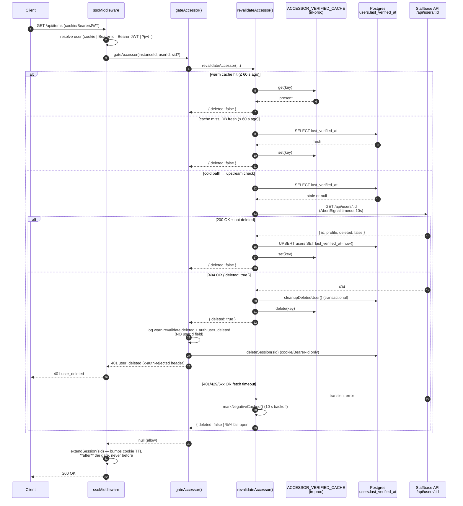
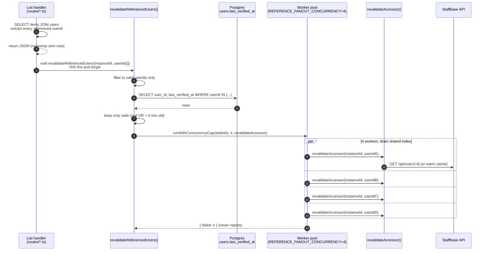
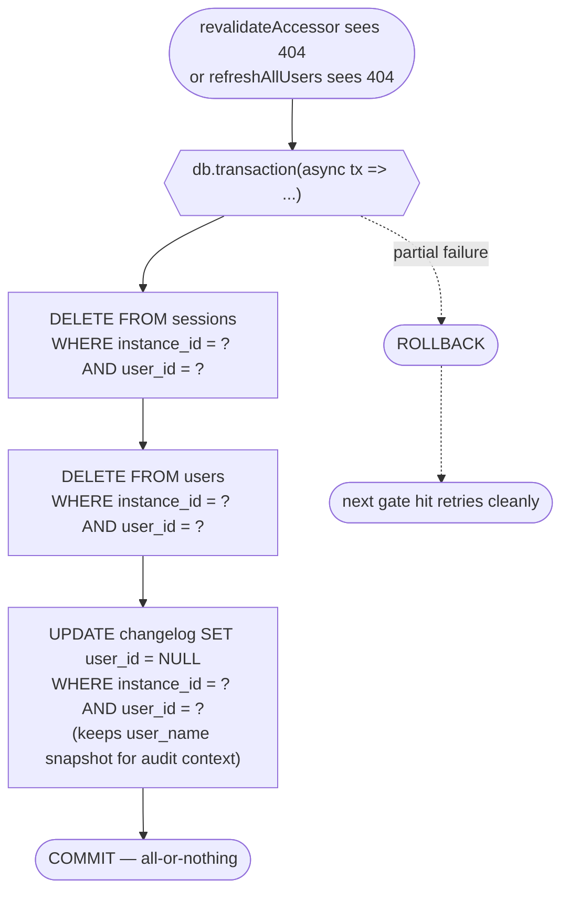

# GDPR hardening — internals

**Companion to:** [GDPR hardening — overview](gdpr-hardening.md). Start
there if you haven't already. This page is the **source-level deep dive**:
full sequence diagrams, caching invariants, threat coverage, config
knobs, and the code map.

> **Heavy sections collapsed by default.** Click any **▶ Deep dive: …**
> block to expand. Synopsis prose and key tables stay visible. Rendered
> with native HTML `<details>` so VSCode preview, GitHub, and mkdocs
> all collapse correctly.

Cross-references:

- [ADR-0011 — User cache lifecycle](../adrs/0011-user-cache-lifecycle.md) — eager fill + reconciliation
- [ADR-0012 — Strict-GDPR user lifecycle](../adrs/0012-strict-gdpr-user-lifecycle.md) — per-request + per-render + background
- [ADR-0013 — Logging contract](../adrs/0013-logging-contract.md) — observability for the above
- [Log catalog](../reference/log-catalog.md) — every warn/info line explained

---

## 1. Layer 1 — Per-request accessor gate

**Owner:** [`server/src/middleware/sso.ts:314`](../../server/src/middleware/sso.ts) (`gateAccessor`) calling [`server/src/lib/user-cache.ts:352`](../../server/src/lib/user-cache.ts) (`revalidateAccessor`).

**Bound:** ≤ `USER_ACCESSOR_REVALIDATE_SECONDS` (default **60 s**) after
upstream delete, the accessor's next request is rejected with
`401 user_deleted`.

**Synopsis.** Every authenticated request runs through `gateAccessor()`.
If we last verified this `(instanceId, userId)` more than 60 seconds ago,
we ask Staffbase whether the user still exists. On 404 we run the
cleanup transaction, kill the session, return `401 user_deleted`. Warm
hits skip everything — typical overhead is one Map lookup. Fail-open on
transient errors.

<details open markdown="1">
<summary>▶ Deep dive: full request → 200/401 sequence</summary>




</details>

<details open markdown="1">
<summary>▶ Deep dive: caching pipeline (in evaluation order)</summary>


| Cache | Scope | Why |
|-------|-------|-----|
| Negative cache ([`user-cache.ts:293`](../../server/src/lib/user-cache.ts)) | 10 s after a non-404 upstream error | Stops a Staffbase 429/503 from becoming a request storm |
| In-flight dedup map ([`user-cache.ts:181`](../../server/src/lib/user-cache.ts)) | N concurrent callers for the same `(instanceId, userId)` | Collapses to one upstream lookup; prevents resurrect-after-delete races |
| `ACCESSOR_VERIFIED_CACHE` ([`user-cache.ts:153`](../../server/src/lib/user-cache.ts)) | 60 s, in-process, 10 k entries | Warm path skips DB + upstream entirely |
| `users.last_verified_at` ([`db/schema.ts:24`](../../server/src/db/schema.ts)) | 60 s, persistent | Cross-replica source of truth |

</details>

<details open markdown="1">
<summary>▶ Deep dive: critical security invariants</summary>


- **`extendSession()` runs AFTER `gateAccessor()`.** If extend ran
  first, a deleted-user request would bump the cookie TTL before
  being rejected — the cookie would slide forward indefinitely.
  Wired carefully on all three session-bearing paths (cookie,
  Bearer-id, Bearer-JWT).
- **`deleteSession(sid)` on rejection** invalidates the cookie/key
  immediately. Without this, the deleted user could retry within
  the next `REVALIDATE_SECONDS` window before the cache row expired.
- **`userId` validated against `^[A-Za-z0-9_-]{1,64}$`** before
  interpolation into the upstream URL
  ([`user-cache.ts:327`](../../server/src/lib/user-cache.ts)).
  `encodeURIComponent` alone does NOT escape `/`, so a userId like
  `"../settings"` would otherwise reach `/api/users/../settings`.
- **Identity-guarded in-flight dedup cleanup**
  ([`user-cache.ts:371`](../../server/src/lib/user-cache.ts)). The
  `.finally()` delete only removes the entry if it still points to
  the same promise — `_clearGdprCachesForTest` between tests cannot
  silently invalidate the next test's entry.
- **`x-auth-rejected` header set at construction time** — some
  Fetch-spec runtimes treat `Response.headers` as immutable after
  `c.json()`. The access-log GDPR carve-out relies on this header.
- **`apiToken` never persists in a module-level Map.**
  `getInstanceSettings` is intentionally NOT memoised — concurrent
  callers are collapsed via the in-flight dedup map but every
  settled call returns to the DB. Rationale: heap dumps, crash-time
  `JSON.stringify`, and accidental log serialisation cannot leak
  the decrypted credential
  ([`user-cache.ts:161-167`](../../server/src/lib/user-cache.ts)).
- **Credential rotation evicts the gate cache.**
  `invalidateInstanceSettingsCache()`
  ([`user-cache.ts:225`](../../server/src/lib/user-cache.ts))
  cascades into `invalidateAccessorVerifiedCacheForInstance()` —
  otherwise warm gate entries would keep admitting requests for up
  to 60 s with the old token still trusted.

</details>
---

## 2. Layer 2 — Per-render reference revalidation

**Owner:** [`server/src/lib/user-cache.ts:518`](../../server/src/lib/user-cache.ts) (`revalidateReferencedUsers`).

**Bound:** ≤ `USER_REFERENCE_REVALIDATE_SECONDS` (default **300 s**) after
delete, the next list render shows the cleaned-up state. Exactly one
render between (delete + ≤ 5 min) and (delete + next render) may still
show the deleted name.

**Synopsis.** Every handler that renders foreign userIds (creators,
reviewers, …) ends with `void revalidateReferencedUsers(…)`. Fire-and-
forget — the list response goes out immediately; in the background a
worker pool (cap 4) re-checks every stale userId and cleans up if any
are deleted. Zero added latency for the caller. Worst case: one stale
render shows a deleted name, then it's gone.

<details open markdown="1">
<summary>▶ Deep dive: fan-out sequence</summary>




</details>

<details open markdown="1">
<summary>▶ Deep dive: design notes</summary>


- **Fire-and-forget by default.** The list response is sent
  **before** revalidation runs. Zero latency penalty for the
  calling user. The deleted user's name appears in *this one*
  render; the next render after the parallel revalidate finishes
  sees the cleaned-up cache. The client-side helper
  [`getOwnerDisplayName`](../../client/src/utils/locale.ts) is the
  single render site that needs to keep faith with this contract —
  per ADR-0011 it must NEVER return a userId, only the resolved
  name or the `user-unknown` i18n string.
- **`STRICT_REFERENCES_BLOCKING=true`** flips this to await. Higher
  guarantee, but ~50-200 ms per stale reference per list response.
- **Concurrency cap of 4.** Hardcoded
  ([`user-cache.ts:173`](../../server/src/lib/user-cache.ts)) to
  prevent a first-boot list render (every reference stale) from
  slamming the Staffbase `/api/users` endpoint. The cap is
  intentionally not an env knob — operators tune the TTL knobs
  instead.
- **`runWithConcurrencyCap` never rejects**
  ([`user-cache.ts:255`](../../server/src/lib/user-cache.ts)).
  Per-item exceptions are counted into `{ failed }` rather than
  propagated, so `void revalidateReferencedUsers(...)` is safe to
  leave un-awaited without unhandled-rejection traces in logs.

</details>

<details markdown="1">
<summary>▶ Wiring example: add to a new list/get handler</summary>


```ts
// In any handler that surfaces foreign userId names (creators, reviewers, …):
const referencedIds = items.flatMap((i) => [i.createdByUserId, i.reviewedByUserId]);
void revalidateReferencedUsers(instanceId, referencedIds);
return c.json({ items });
```

Already wired in the template's admin + widget list endpoints. Add
the same call site to any new route that joins on a foreign userId.

</details>
---

## 3. Layer 3 — Background sweep

**Owner:** `refreshAllUsers()` in `server/src/index.ts` (interval-driven).

**Cadence:** `USER_CACHE_REFRESH_HOURS` (default **1.5 h**, tightened from
the original 2.5 h when ADR-0012 landed).

**Synopsis.** A setInterval task every 1.5 hours iterates every row in
the local `users` cache table per instance
([`user-cache.ts:747-750`](../../server/src/lib/user-cache.ts) —
`SELECT user_id FROM users WHERE instance_id = ?`) and calls
Staffbase `/api/users/:id` for each. On 404 it runs
`cleanupDeletedUser()` (which also nullifies `changelog.user_id` for
that user). Catches users whose cache row exists but who never came
back through Layer 1 or Layer 2 since the last sweep.

> **Boundary — what Layer 3 does NOT cover.** A user referenced ONLY
> in `changelog.user_id` who never had a `users` row (never authed,
> never eager-filled via `ensureUserInCache`) is invisible to all
> three layers. Fine for PII rendering: the LEFT JOIN goes null and
> the renderer shows `user-unknown` per the ADR-0011 contract. But
> the opaque Mongo userId still sits in `changelog.user_id` until
> one of:
>
> - The user logs in once (Layer 1 creates the cache row → next sweep
>   cleans up).
> - A handler explicitly calls `ensureUserInCache(instanceId, userId)`
>   for that id (write-through path documented in ADR-0011).
> - `deleteInstance()` runs for the tenant (full purge).
>
> If your tenant compliance bar treats the opaque userId as PII, add
> a periodic job that pulls distinct `user_id`s from `changelog`,
> calls `ensureUserInCache` for each, and lets Layer 3 catch up. Not
> shipped in the template today because the userId is upstream-owned
> and not considered PII by Staffbase's classification.

The combined load of all three layers is not 3× the sum: Layer 2
stale-checks the same `last_verified_at` column Layer 1 writes, so a
render immediately after a gate-driven revalidation skips Layer 2
entirely; Layer 3 only fires for users untouched by 1 or 2 since the
last sweep.

---

## 4. Transactional purge

**Owner:** [`server/src/lib/remote-calls.ts:35`](../../server/src/lib/remote-calls.ts) (`cleanupDeletedUser`).

**Synopsis.** Whenever any layer confirms a deletion, the cleanup writes
(sessions DELETE, users DELETE, changelog UPDATE `user_id`→NULL) run
inside one `db.transaction(...)`. Partial DB failures roll back
atomically; the next gate hit retries from a clean state. Every WHERE
clause is scoped by `(instance_id, user_id)` — defence-in-depth for
tenancy.

<details open markdown="1">
<summary>▶ Deep dive: cleanup transaction flowchart</summary>




</details>

<details markdown="1">
<summary>▶ Why every WHERE clause is scoped by `(instance_id, user_id)`</summary>


Staffbase userIds are globally-unique 24-char ObjectIds today, so
`WHERE user_id = ?` alone is practically safe. Defence-in-depth
requires scoping by **both** identifiers anyway:

- If the schema ever grows multi-tenant tables that share userId
  values, the WHERE clause stays correct without an audit.
- A future fix that introduces non-unique userIds (e.g. external-
  system IDs, anonymous-user IDs) does not silently start deleting
  across tenants.
- The `appOwners`-style tables that lack an `instance_id` column
  are scoped via a subquery on the parent table's `instance_id` —
  see the app launchpad PR #90 review-4 fix for the canonical
  pattern when this comes up.

</details>

<details markdown="1">
<summary>▶ `deleteInstance(instanceId)` — full instance purge</summary>


Sister function in the same file
([`remote-calls.ts:61`](../../server/src/lib/remote-calls.ts)).
Runs when Staffbase sends the instance-purge handshake (`sub ===
"delete"` JWT). Deletes every plugin row for that instance — also
transactional, also ordered by FK shape. The middleware in
[`server/src/app.ts:83`](../../server/src/app.ts) intercepts the
handshake **before** SSO; the `gateAccessor` skips `userId ===
"delete"` explicitly.

**LocalDev bypass (intentional).** The delete-intercept is bypassed
only when:

- `IS_REAL_LOCALDEV=true` (gated by `NODE_ENV === "development"` —
  an allowlist, no fallback),
- AND the request is `POST` with `?jwt=dev`.

Any other `?jwt=` value still goes through real JWT validation. A
misconfigured `IS_LOCALDEV=true` in CI or staging cannot disable the
production delete handshake.

</details>
---

## 5. Logging contract

Every step above emits a structured log line that downstream alerts and
incident response key off. Full reference: [Log catalog](../reference/log-catalog.md)
and [ADR-0013](../adrs/0013-logging-contract.md).

| Event | Module | Severity | Triggered by | Production meaning |
|-------|--------|----------|--------------|--------------------|
| `auth.user_deleted` | `sso` | warn | Layer 1 rejection | A user was rejected because Staffbase says they no longer exist. `userId` is intentionally stripped from this log line. |
| `revalidate.deleted` | `user-cache` | warn | `revalidateAccessor` saw 404 or `{deleted:true}` | The cleanup transaction ran. |
| `revalidate.upstream_error` | `user-cache` | trace | non-404 upstream error | Staffbase returned 401/429/5xx or fetch timed out; user remains allowed (fail-open) until negative-cache TTL expires. |
| `revalidate.failed` | `user-cache` | trace | Fetch threw or JSON parse failed | Same fail-open semantics. |
| `references.lookup_failed` | `user-cache` | warn | Layer 2 cache lookup threw | Background reference revalidation is degraded; Layer 3 sweep still covers eventually. |
| `auth.user_deleted.session_delete_failed` | `sso` | error | `deleteSession()` threw inside `gateAccessor` rejection path | The 401 was returned; the row drop failed. Cookie still revalidates next request and gets rejected again. |
| `API response error.` | `api` | warn | Staffbase API returned non-OK | Includes `instanceUrl` + `url.path` + `http.response.status_code`. The companion line to `revalidate.deleted` when the underlying 404 came from `/api/users/:id`. |

<details markdown="1">
<summary>▶ What's intentionally *not* logged</summary>


- The deleted user's `userId` in `auth.user_deleted`. The HTTP
  access-log also drops `userId` whenever the response carries
  `x-auth-rejected: user_deleted`
  ([`access-log.ts:124-126`](../../server/src/middleware/access-log.ts)).
- The decrypted `apiToken` anywhere. The TRACE-level
  `staffbase-api.ts` detail log redacts the `Authorization` header.
- Free-text user input (titles, descriptions). The DB and changelog
  are the source of truth for content; logs carry IDs and counts
  only.

</details>
---

## 6. Configuration

All TTL knobs sit in [`.env.example`](../../.env.example) and are loaded
once at module-init time.

| Env var | Default | Meaning |
|---------|---------|---------|
| `USER_ACCESSOR_REVALIDATE_SECONDS` | `60` | Layer 1 TTL — accessor revalidation. Set to `0` to revalidate on every request. |
| `USER_REFERENCE_REVALIDATE_SECONDS` | `300` | Layer 2 TTL — reference revalidation. |
| `STRICT_REFERENCES_BLOCKING` | `false` | If `true`, Layer 2 awaits all revalidations (no fire-and-forget). Slower lists, no stale render. |
| `USER_REVALIDATE_NEGATIVE_BACKOFF_SECONDS` | `10` | Negative-cache window after non-404 upstream errors. Operators tune up during sustained Staffbase outages. |
| `USER_CACHE_REFRESH_HOURS` | `1.5` | Layer 3 sweep cadence. |
| `SESSION_TTL_HOURS` | `8` | Session cookie max age — bounds the worst-case retention if Layer 1 somehow fails. |
| `IS_LOCALDEV` | (unset) | Bypass SSO + GDPR gate. Honoured only when set on the *server* env; ignored if injected via request headers. |
| `IS_REAL_LOCALDEV` | (unset) | Strict gate (`NODE_ENV==="development"` required) for the delete-handshake bypass. |

---

## 7. Threat scenarios and what catches them

| Scenario | Caught by | Time-to-catch |
|----------|-----------|---------------|
| User deleted in Staffbase, makes next plugin request | Layer 1 gate | ≤ 60 s |
| User deleted in Staffbase, never returns to plugin but is referenced in someone else's list view | Layer 2 fan-out | ≤ 5 min from first render after delete |
| User deleted in Staffbase, never returns and never appears in any rendered list | Layer 3 sweep | ≤ 1.5 h |
| Partial DB failure mid-cleanup | `db.transaction` rollback | Immediate; next gate hit retries cleanly |
| Staffbase API outage (429/503) | Negative cache + fail-open | All users stay served; reconciles within `NEGATIVE_BACKOFF_MS` after recovery |
| Concurrent revalidations for the same userId resurrect a cleaned row | In-flight dedup map + identity-guarded cleanup | Resolved structurally; cannot happen |
| Path traversal in userId reaches `/api/users/../foo` | `isValidUserId()` allowlist | Rejected before upstream call |
| Credential rotation leaves warm gate cache trusting old token | `invalidateInstanceSettingsCache()` cascades to `invalidateAccessorVerifiedCacheForInstance()` | Immediate on settings PUT |
| Deleted user's identifier persisted in log retention | Log-shape contract (`auth.user_deleted` drops userId; access-log GDPR carve-out on `x-auth-rejected`) | At write-time |
| Hung Staffbase request leaves in-flight dedup entry forever | `AbortSignal.timeout(10_000)` on upstream fetch | 10 s |
| Misconfigured `IS_LOCALDEV=true` in staging disables the delete intercept | `IS_REAL_LOCALDEV` requires `NODE_ENV==="development"` AND POST + `?jwt=dev` | Structurally impossible in non-dev env |

---

## 8. Where this lives in the codebase

```
server/src/
├── app.ts                          # delete-intercept middleware (top-level)
├── middleware/
│   ├── sso.ts                      # gateAccessor() + ssoMiddleware (4 auth paths)
│   └── access-log.ts               # http access log + GDPR carve-out on userId
├── lib/
│   ├── user-cache.ts               # revalidateAccessor, revalidateReferencedUsers, all caches
│   ├── ttl-cache.ts                # O(1) per-replica TTL cache primitive
│   ├── remote-calls.ts             # cleanupDeletedUser + deleteInstance (transactional)
│   ├── staffbase-api.ts            # staffbaseFetch wrapper (timeout + "API response error" log)
│   ├── sessions.ts                 # createSession / extendSession / deleteSession
│   └── logger.ts                   # createLogger, redact
└── db/
    ├── schema.ts                   # users.last_verified_at column
    └── client.ts                   # db.transaction() entry point
```

Co-located tests in `server/test/`. The most load-bearing of these are
`user-cache.test.ts` (every cache-pipeline branch), `sso.test.ts`
(every gate path including the `IS_REAL_LOCALDEV` gates), and
`remote-calls.test.ts` (cleanup transactionality).

---

## 9. Adopting in a downstream plugin

The template is canonical. Two ways to bring a downstream plugin up to
this baseline:

1. **Auto-sync (preferred).** Opt in via `.template-sync.yml` at the
   repo root. The template-sync workflow opens a DRAFT PR with the
   layered changes; review it, label `dev` to trigger the autodev →
   dev cluster preview, then merge. See
   [Template sync](../guides/template-sync.md).
2. **Manual cherry-pick.** For one-off audits, the relevant commits in
   this repo are tagged `fix(gdpr,security,…)` / `perf(gdpr)` —
   `git log --grep='gdpr\|security' --since='2026-05-01'`.

Downstream plugins should **not** re-document the layer model — link to
the [overview page](gdpr-hardening.md) from their `docs/` index
instead, and only document their plugin-specific extensions to the
cleanup transaction.

---

## 10. History

- **2026-05-21** — ADR-0011 lands the user cache + display contract.
- **2026-05-22** — App Launchpad PR #90 hardens the gate against a
  multi-hour deletion window observed in dev/de1.
- **2026-05-22** — ADR-0012 generalises Layer 1 + Layer 2; ADR-0013
  owns the logging contract.
- **2026-05-22** — Glossary PR #12 fixes a Drizzle `users.userName`
  projection that emitted malformed SQL on creators/owners list
  endpoints (operator-precedence multi-tenancy leak in the surrounding
  `and(where.apps, sql\`OR…OR…OR…\`)` clause). Same shape repeats in
  applaunchpad PR #90 review-swarm — identical fix pattern.
- **2026-05-23** — App Launchpad PR #91 lands the in-process TTL cache,
  in-flight dedup, concurrency cap, and credential-rotation cascade.
- **2026-05-23** — Review rounds 2 → 7 cross-port to the canonical
  template (`cross-port AL PR #90/r2…r7 hardening to canonical`).
- **2026-05-23** — `vault-bootstrap.sh` security fix: replace `source
  $ENV_FILE` with safe `KEY=value` parser so a typo'd / hostile env
  line cannot exfiltrate the Vault token. Back-port from applaunchpad.
- **2026-05-23** — Docs split — overview page stays at
  `gdpr-hardening.md`, source-level depth moves to this page.
