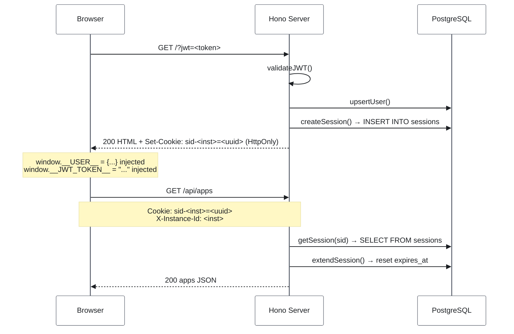
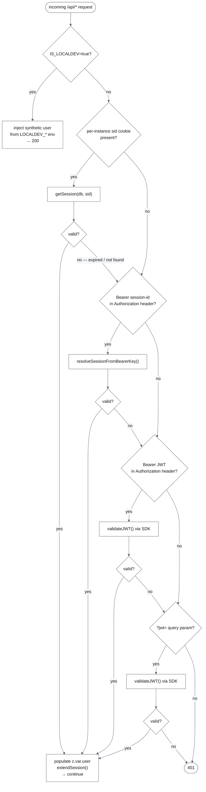

# Session Management

This document covers the full session lifecycle: how sessions are created, validated, extended, expired, and cleaned up — plus a guide for verifying session behaviour locally.

## Contents

- [Why sessions exist](#why-sessions-exist)
- [Architecture overview](#architecture-overview)
- [Request auth decision tree](#request-auth-decision-tree)
- [Key files](#key-files)
- [Session lifecycle](#session-lifecycle)
- [Environment variables](#environment-variables)
- [DB schema — `sessions` table](#db-schema--sessions-table)
- [Security invariants](#security-invariants)
- [JWT URL transport hardening](#jwt-url-transport-hardening)
- [Local development](#local-development)
- [How to test all changes locally](#how-to-test-all-changes-locally)
- [User identity injection](#user-identity-injection)
- [JWT claims reference](#jwt-claims-reference)
- [Backend-initiated session invalidation](#backend-initiated-session-invalidation-delete-apiuserssession)
- [GDPR compliance](#gdpr-compliance)

---

## Why sessions exist

The Staffbase JWT embedded in the iframe URL has a short fixed lifetime (typically ~1 min). Without server-side sessions, users would receive a 401 mid-session once the JWT expires. The `sessions` table decouples API auth from JWT lifetime: once a session is created on page load, all subsequent API calls are authorised via the `sid` cookie without re-validating the JWT.

---

## Architecture overview



---

## Request auth decision tree



---

## Key files

| File                             | Role                                                                                              |
| -------------------------------- | ------------------------------------------------------------------------------------------------- |
| `server/src/lib/sessions.ts`     | `createSession`, `getSession`, `extendSession`, `deleteSession`, `deleteSessionsByStaffbaseHash`, `cleanExpiredSessions` |
| `server/src/lib/remote-calls.ts` | `deleteInstance` (GDPR purge), `cleanupDeletedUser` (SCIM cleanup)                                |
| `server/src/lib/user-cache.ts`   | `upsertUser` (write-through) + SCIM-batched `refreshAllUsers`                                     |
| `server/src/middleware/sso.ts`   | Cookie-first auth, `?jwt=` param + `extractSidClaim()`, localdev bypass                           |
| `server/src/routes/html.ts`      | Reuses or (re)creates the `sid` session on page load                                              |
| `server/src/html.ts`             | `injectUser()` + `injectToken()` — identity + JWT into SPA HTML                                   |
| `server/src/index.ts`            | Separate background intervals for user-cache refresh and session cleanup                          |
| `server/src/db/schema.ts`        | `sessions` table definition (incl. `staffbase_session_hash`)                                      |

---

## Session lifecycle

### 1. Creation / reuse — `issueSession()` → `createSession()`

Called by `routes/html.ts` on every `GET /`, `GET /favorites`, `GET /admin` after JWT validation.

**Before inserting a new row, `issueSession()` first tries to reuse an existing one:**

1. Read the per-instance `sid` cookie (`sid-<instanceId>`).
2. If present, call `getSession(sid)`. Reuse the row when it is valid **and** `userId`, `instanceId`, `role`, and `staffbaseSessionHash` all match the fresh JWT.
   - Match → `extendSession(sid)` + refresh the cookie `Max-Age`, return the existing sid. No new row.
   - Mismatch (role change, different platform session, different user) → `deleteSession(sid)` + fall through to create.
3. If no cookie or no reusable session → insert a new row via `createSession()`.

This prevents a new `sessions` row from being accumulated on every page load (e.g. when the user refreshes the browser or navigates between plugin pages).

```typescript
// Simplified issueSession() logic
const existingSid = getCookie(c, sessionCookieName(user.instanceId));
if (existingSid) {
  const existing = await getSession(existingSid);
  if (
    existing &&
    existing.userId === user.userId &&
    existing.instanceId === user.instanceId &&
    existing.role === user.role &&
    (user.staffbaseSessionHash === null ||
      existing.staffbaseSessionHash === user.staffbaseSessionHash)
  ) {
    await extendSession(existingSid); // slide TTL
    setCookie(c, cookieName, existingSid, { maxAge: ttlSeconds, … });
    return existingSid; // reuse — no INSERT
  }
  await deleteSession(existingSid); // stale — remove before creating
}
return createSession({ userId, instanceId, role, staffbaseSessionHash });
```

**Cookie flags** (non-negotiable):

- `HttpOnly` — not accessible from JavaScript
- `Secure` — HTTPS only
- `SameSite=None` — required for cross-site iframe embedding; the plugin runs on a different origin from the Staffbase platform

### 2. Validation — `getSession()`

Called by `ssoMiddleware` on every `/api/*` request when a `sid` cookie is present:

```typescript
const session = await db
  .select()
  .from(sessions)
  .where(and(eq(sessions.id, sid), gt(sessions.expiresAt, new Date())))
  .limit(1);
```

Returns `null` if the session does not exist or is expired. `ssoMiddleware` falls through to JWT validation when `null`.

### 3. Sliding expiry — `extendSession()`

Called by `ssoMiddleware` after every successful session auth (if `SESSION_SLIDING=true`, the default):

- Resets `expires_at` to `NOW() + SESSION_TTL_HOURS`
- Is a no-op if the session is already expired (safe to call unconditionally after `getSession`)

### 4. Cleanup — `cleanExpiredSessions()`

Runs on its own `SESSION_CLEANUP_HOURS` interval (default **1 h**), and once on server startup (after a 30 s delay). The user-cache refresh runs independently on the `USER_CACHE_REFRESH_HOURS` interval (default 2.5 h). Both tasks are started from `server/src/index.ts` via `runSessionCleanup()` and `runUserCacheRefresh()` respectively.

```typescript
await db.delete(sessions).where(lt(sessions.expiresAt, new Date()));
```

---

## Environment variables

| Variable                   | Default | Effect                                                                |
| -------------------------- | ------- | --------------------------------------------------------------------- |
| `SESSION_TTL_HOURS`        | `8`     | Session lifetime in hours                                             |
| `SESSION_SLIDING`          | `true`  | Reset TTL on every authenticated request                              |
| `SESSION_CLEANUP_HOURS`    | `1`     | Interval (hours) for the `runSessionCleanup()` background task        |
| `USER_CACHE_REFRESH_HOURS` | `2.5`   | Interval (hours) for the `runUserCacheRefresh()` background task      |

---

## DB schema — `sessions` table

```sql
CREATE TABLE sessions (
  id                      TEXT PRIMARY KEY,  -- crypto.randomUUID()
  user_id                 TEXT NOT NULL,
  instance_id             TEXT NOT NULL,
  role                    TEXT NOT NULL,     -- "editor" | "user"
  expires_at              TIMESTAMP NOT NULL,
  created_at              TIMESTAMP NOT NULL DEFAULT NOW(),
  staffbase_session_hash  TEXT               -- NULL for pre-migration rows
);

CREATE INDEX sessions_user_id_idx       ON sessions (user_id);
CREATE INDEX sessions_expires_at_idx    ON sessions (expires_at);
CREATE INDEX sessions_staffbase_hash_idx ON sessions (instance_id, staffbase_session_hash);
```

`staffbase_session_hash` is `createHash(accessorId + installationId + sessionId)` as computed by `EyoSSOFacade.generateToken()` on the Staffbase backend. It is stored on every session created after migration 0015 and is used by the `DELETE /api/users/session` invalidation handler to locate rows without knowing the user's `sub` (which is empty in the anonymous invalidation token).

No foreign keys — `sessions` is ephemeral and independent of the `users` cache.

---

## Security invariants

- Session IDs are `crypto.randomUUID()` — 128-bit random, unguessable
- The `sid` value is **never** logged anywhere server-side
- The `sid` cookie is `HttpOnly` — client-side JavaScript cannot read it
- `SameSite=None` is required because the plugin iframe runs cross-origin from the Staffbase platform. CSRF is mitigated by CORS preflight (non-GET requests require the correct `Origin`) and JSON `Content-Type` requirement
- `extendSession()` only updates rows where `expires_at > NOW()` — cannot resurrect expired sessions
- Session rows are removed by `cleanExpiredSessions()` (time-based background purge) **and** by `cleanupDeletedUser()` (triggered by the SCIM refresh cycle when a Staffbase user no longer exists) — individual feature routes never delete session rows

---

## JWT URL transport hardening

The `?jwt=` query parameter is a platform-delivery mechanism outside this plugin's control. Four defence-in-depth layers (documented in [ADR-0005](../adrs/0005-jwt-transport-hardening.md)) reduce the URL-exposure window:

| Layer | Mechanism | Status |
|---|---|---|
| 1 – One-time consumption | JWT validated once on page load; all subsequent requests use the session cookie only | ✅ |
| 2 – Referrer-Policy | `Referrer-Policy: no-referrer` prevents the `?jwt=` URL appearing in `Referer` headers sent by the browser to subresources | ✅ (via `secureHeaders` in `app.ts`) |
| 3 – History clean-up | `history.replaceState` removes `?jwt=` from the browser URL and history stack immediately after page bootstrap | ✅ (`client/src/main.tsx`) |
| 4 – Dynamic frame-ancestors | `Content-Security-Policy: frame-ancestors 'self' https://<parent> https://<issuerDomain> http://staffbase.com capacitor://<parent> capacitor://staffbase.com https://localhost` per HTML response — covers customer apex + subdomain, native Capacitor apps, and local dev; derived dynamically from `issuer_domain` JWT claim | ✅ (`routes/html.ts`) |

> The `issuerDomain` is extracted from the JWT `issuer_domain` claim by `extractIssuerDomain()` in `middleware/sso.ts` and stored as `issuerDomain` on the resolved user object. It is also written to `settings.staffbase_url` (fire-and-forget) via `upsertStaffbaseUrl()`.

---

## Local development

`IS_LOCALDEV=true` (the default in `.env.example`) **bypasses all session and JWT checks**. The `sessions` table is never read or written. This is intentional — it removes the need for real Staffbase credentials during development.

### Option A — inject a session directly into the DB

Use this to test the real session code path without a valid JWT:

```bash
docker compose exec postgres psql -U dev -d cc-custom-plugin-template -c "
  INSERT INTO sessions (id, user_id, instance_id, role, expires_at, created_at)
  VALUES (
    'test-sid-1234',
    'local-user-1',
    'dev-instance',
    'editor',
    NOW() + INTERVAL '8 hours',
    NOW()
  ) ON CONFLICT DO NOTHING;
"
```

Then call any API route with the cookie:

```bash
curl -s http://localhost:3000/api/apps \
  -H "Cookie: sid=test-sid-1234" | jq .
# → 200 with apps array (IS_LOCALDEV must be false)
```

Set `IS_LOCALDEV=false` in `.env` first, and provide any non-empty `PLUGIN_ID` / `PUBLIC_KEY` (the session path bypasses JWT validation entirely, so the values don't matter as long as the env vars are present).

### Option B — real JWT

Set real credentials in `.env` (`PLUGIN_ID`, `PUBLIC_KEY`, `IS_LOCALDEV=false`), then load `http://localhost:5173/?jwt=<valid-token>`. The full flow runs: JWT validated → session created → `sid` cookie set.

### What to verify

| Check                                | How                                                                                                                         |
| ------------------------------------ | --------------------------------------------------------------------------------------------------------------------------- |
| Session row created on page load     | pgweb (`http://localhost:8081`) → `sessions` table                                                                          |
| `sid` cookie set with correct flags  | Browser DevTools → Application → Cookies → `HttpOnly` ✓, `SameSite=None` ✓                                                  |
| Session used for subsequent requests | Make API calls with the `sid` cookie set; should return 200                                                                 |
| Sliding TTL advancing                | Note `expires_at` in pgweb, make a request, refresh — value should increase                                                 |
| Expired session returns 401          | `UPDATE sessions SET expires_at = NOW() - INTERVAL '1 hour' WHERE id = 'test-sid-1234';` then call `/api/apps` — expect 401 |
| Cleanup removes expired rows         | Set `SESSION_CLEANUP_HOURS=0.001` (≈4s interval) in `.env`, wait, check `sessions` table empties                            |
| 401 with no cookie                   | Call `/api/apps` with no cookie → expect `{"error":"Unauthorized"}`                                                         |

---

## How to test all changes locally

All tests below require `IS_LOCALDEV=false` in `.env` unless otherwise noted.  
Use a real `PLUGIN_ID` + `PUBLIC_KEY` from the Staffbase platform team, or generate a test key pair (see Option A below for a workaround using DB-injected sessions that avoids needing valid credentials for most checks).

### Prerequisites

```bash
# 1. Stop any running dev server, then set IS_LOCALDEV=false in .env
# 2. Set placeholder values so the server starts (session path skips JWT validation):
#    PLUGIN_ID=test
#    PUBLIC_KEY=test
#    IS_LOCALDEV=false
# 3. Restart the server
bun run dev:apps
```

pgweb is available at `http://localhost:8081` for all DB inspection steps.

---

### 1 · Cookie flags — `SameSite=None; Secure; HttpOnly`

**Setup:** Use Option A (DB-injected session) from the section above.

**Steps:**

1. Open `http://localhost:5173` in Firefox or Chrome
2. Open DevTools → Application → Cookies → `localhost`
3. Find the `sid` cookie

**Expected:**

- `HttpOnly`: ✓ (checked)
- `Secure`: ✓ (only works on HTTPS in production; `localhost` is an exception in most browsers)
- `SameSite`: `None`

> `SameSite=None` requires `Secure=true` per the spec. Chrome will silently drop `SameSite=None` cookies without `Secure`. In local HTTP this is expected; the flag is enforced when deployed over HTTPS.

---

### 2 · `window.__USER__` — full identity injected

**Setup:** `IS_LOCALDEV=true` works for this check (uses env-var identity).

**Steps:**

1. Start the app with `bun run dev` (Vite dev server at `:5173`)
2. Open `http://localhost:5173` in a browser
3. Open DevTools → Console

```js
// Run in DevTools console:
console.log(window.__USER__);
```

**Expected output (IS_LOCALDEV=true):**

```json
{
  "userId": "local-user-1",
  "userName": "Local Dev User",
  "instanceId": "dev-instance",
  "role": "editor",
  "firstName": null,
  "lastName": null,
  "locale": null,
  "type": "user",
  "branchId": null,
  "externalId": null,
  "issuerDomain": null,
  "branchSlug": null
}
```

For a real JWT page load verify via `View Page Source` — look for `window.__USER__ = {…}` immediately before `</head>`. All values should be non-null for a fully provisioned Staffbase user.

---

### 3 · API calls use `Cookie: sid=…` for auth

**Setup:** `IS_LOCALDEV=false`, session injected via Option A OR real JWT page load.

**Steps:**

1. Load `http://localhost:5173` in the browser
2. Open DevTools → Network → Filter: `/api/apps`
3. Trigger any app list load

**Expected request headers:**

```
Cookie: sid=<uuid>
```

All API auth runs through the session cookie. Clearing the `sid` cookie and triggering an API call will return 401 (session expiry overlay).

---

### 4 · Session expiry overlay

**Setup:** `IS_LOCALDEV=false`, session injected (Option A).

**Steps:**

```bash
# With the app open in the browser, expire the session:
docker compose exec postgres psql -U dev -d cc-custom-plugin-template -c \
  "UPDATE sessions SET expires_at = NOW() - INTERVAL '1 hour' WHERE id = 'test-sid-1234';"
```

Then in the browser:

1. Wait a moment (no page reload needed)
2. Trigger any action that calls the API (e.g. toggle a favorite)

**Expected:** A dark overlay appears with a "Session expired" heading and a "Reload" button.  
**Confirm:** The reload button calls `location.reload()` — clicking it should restart the auth flow.

> The overlay is rendered by `client/src/context/SessionContext.tsx`. It fires when `api/index.ts` receives a 401 and `getToken() !== "dev"`. With `IS_LOCALDEV=true` the overlay never appears by design.

---

### 5 · Admin page blocks non-editors

**Setup:** `IS_LOCALDEV=true` (simplest). Works on both `:5173` (Vite) and `:3000` (Hono).

> **Note:** `LOCALDEV_ROLE` controls two independent paths:
>
> - **Hono (`:3000`)** reads `Bun.env.LOCALDEV_ROLE` at request time — change takes effect immediately, no restart needed
> - **Vite (`:5173`)** bakes `LOCALDEV_ROLE` into the bundle at startup via `vite.config.ts` — **restart Vite** (`bun run dev:apps`) after changing this env var or the old role will stay in effect

**Test user role:**

```bash
# In .env: LOCALDEV_ROLE=user
# Restart both servers (bun run dev:apps). Navigate to http://localhost:5173/admin
```

**Expected:** Client redirects to `/` (AdminView's `<Navigate to="/" replace />`); Hono also returns 403 for a direct request to `:3000/admin`.

```bash
# Switch back: LOCALDEV_ROLE=editor
# Restart both servers. Navigate to http://localhost:5173/admin
```

**Expected:** Admin view loads normally.

---

### 6 · deleteInstance remote call (GDPR)

This requires a valid JWT signed with your `PLUGIN_ID` + `PUBLIC_KEY` where `sub = "delete"`. The easiest approach is to use the Staffbase SDK to mint a test token in a small script.

**Alternatively — mock-test the handler directly:**

```bash
# With IS_LOCALDEV=false and a session in the DB, supply data to delete:
docker compose exec postgres psql -U dev -d cc-custom-plugin-template -c "
  SELECT COUNT(*) FROM apps WHERE instance_id = 'dev-instance';
  SELECT COUNT(*) FROM users WHERE instance_id = 'dev-instance';
  SELECT COUNT(*) FROM sessions WHERE instance_id = 'dev-instance';
"
# Then invoke deleteInstance via a bun script (no HTTP needed):
```

```typescript
// scripts/test-delete-instance.ts
import { db } from "./server/src/db/client.ts";
import { deleteInstance } from "./server/src/lib/remote-calls.ts";

const ok = await deleteInstance("dev-instance");
console.log("deleteInstance returned:", ok);
process.exit(ok ? 0 : 1);
```

```bash
bun run scripts/test-delete-instance.ts
# Then verify all tables are empty for instance_id = 'dev-instance'
docker compose exec postgres psql -U dev -d cc-custom-plugin-template -c "
  SELECT 'apps' AS t, COUNT(*) FROM apps WHERE instance_id = 'dev-instance'
  UNION ALL
  SELECT 'tags',     COUNT(*) FROM tags WHERE instance_id = 'dev-instance'
  UNION ALL
  SELECT 'users',    COUNT(*) FROM users WHERE instance_id = 'dev-instance'
  UNION ALL
  SELECT 'sessions', COUNT(*) FROM sessions WHERE instance_id = 'dev-instance'
  UNION ALL
  SELECT 'favorites',COUNT(*) FROM favorites WHERE instance_id = 'dev-instance';
"
# → all counts should be 0
```

---

### 7 · SCIM user cleanup (`cleanupDeletedUser`)

```bash
# 1. Insert a test user and link them to an app:
docker compose exec postgres psql -U dev -d cc-custom-plugin-template -c "
  INSERT INTO users (user_id, instance_id, first_name, last_name, status, updated_at)
  VALUES ('ghost-user', 'dev-instance', 'Ghost', 'User', 'active', NOW())
  ON CONFLICT DO NOTHING;

  -- Mark an existing app as created by this user:
  UPDATE apps SET created_by_user_id = 'ghost-user'
  WHERE instance_id = 'dev-instance' LIMIT 1;
"
```

```typescript
// scripts/test-cleanup-user.ts
import { cleanupDeletedUser } from "./server/src/lib/remote-calls.ts";

await cleanupDeletedUser("ghost-user");
console.log("cleanupDeletedUser done");
```

```bash
bun run scripts/test-cleanup-user.ts

# Verify:
docker compose exec postgres psql -U dev -d cc-custom-plugin-template -c "
  SELECT 'user row' AS check, COUNT(*) FROM users WHERE user_id = 'ghost-user'
  UNION ALL
  SELECT 'app_owners', COUNT(*) FROM app_owners WHERE user_id = 'ghost-user'
  UNION ALL
  SELECT 'favorites',  COUNT(*) FROM favorites WHERE user_id = 'ghost-user'
  UNION ALL
  SELECT 'sessions',   COUNT(*) FROM sessions WHERE user_id = 'ghost-user'
  UNION ALL
  SELECT 'apps with ghost as creator',
    COUNT(*) FROM apps WHERE created_by_user_id = 'ghost-user';
"
# → all counts 0; apps themselves still exist with created_by_user_id = NULL
```

---

## User identity injection

On every page load `routes/html.ts` injects three globals before `</head>`:

```html
<script>
  window.__USER__ = {
    userId: "…",
    userName: "…",
    instanceId: "…",
    role: "user",
    firstName: "…",
    lastName: null,
    locale: "en_US",
    type: "user",
    branchId: "…",
    externalId: null,
    issuerDomain: "tenant.staffbase.com",
    branchSlug: "…",
  };
</script>
<script>
  window.__JWT_TOKEN__ = "eyJ…";
</script>
<script>
  window.__SESSION_KEY__ = "b2e8…-…-…-…-…";
</script>
```

`window.__USER__` contains the full user identity extracted from the JWT (or from the localdev env vars in `IS_LOCALDEV=true` mode). `AuthContext.tsx` reads it at React boot — no client-side JWT decoding. `issuerDomain` and `branchSlug` are decoded from the raw JWT payload (the SDK does not expose them on its user object) and are used for dynamic CSP `frame-ancestors` and branch-scoped content queries respectively.

`window.__JWT_TOKEN__` is kept as an opaque string in the `token.ts` module singleton. The client **never decodes the JWT** — only `__USER__` is parsed for identity. The JWT is not sent on subsequent API calls; all API authentication uses the `sid` session cookie.

`window.__SESSION_KEY__` carries the newly issued session UUID. It is a Safari ITP fallback: when the browser silently drops the `SameSite=None` session cookie, the SDK's `apiClient` attaches the key as `Authorization: Bearer <uuid>` so auth still succeeds. See [ADR-0005 — Layer 5](../adrs/0005-jwt-transport-hardening.md) and `injectSessionKey()` in `server/src/html.ts`.

`<`, `>`, `&`, `"`, and `'` are HTML-entity-escaped in `__JWT_TOKEN__` and `__SESSION_KEY__`; `<`, `>`, and `&` are Unicode-escaped in the `__USER__` JSON (`\u003c`, `\u003e`, `\u0026`) to prevent XSS via crafted values.

---

## JWT claims reference

All claims extracted by `parseTokenUser()` in `server/src/middleware/sso.ts`:

| Claim         | SDK getter            | Field in `AppEnv` user | Stored in `users` table |
| ------------- | --------------------- | ---------------------- | ----------------------- |
| `sub`         | `getUserId()`         | `userId`               | PK                      |
| `name`        | `getUserName()`       | `userName`             | split into first/last   |
| `role`        | `getRole()`           | `role`                 | no (in sessions)        |
| `instance_id` | `getInstanceId()`     | `instanceId`           | yes                     |
| `given_name`  | `getFirstName()`      | `firstName`            | yes                     |
| `family_name` | `getLastName()`       | `lastName`             | yes                     |
| `locale`      | `getLocale()`         | `locale`               | no                      |
| `type`        | `getType()`           | `type`                 | no                      |
| `branch_id`   | `getBranchId()`       | `branchId`             | no                      |
| `external_id` | `getUserExternalId()` | `externalId`           | no                      |
| `sid`         | _(raw JWT payload)_   | `staffbaseSessionHash` | no (in sessions)        |

Extended claims (`firstName` through `externalId`) are `null` when the request is authenticated via the `sid` session cookie rather than a fresh JWT — only the page-load path runs `parseTokenUser()`.

---

## Backend-initiated session invalidation (`DELETE /api/users/session`)

When a user logs out of the Staffbase platform, the backend notifies all **session-managed** plugins so they can clean up the user's server-side sessions. This ensures a user who logs out of Staffbase cannot continue to make authenticated API calls to the plugin via a stale `sid` cookie.

### How it works

1. User calls `DELETE /api/users/{userId}/sessions` on the Staffbase backend (or logs out via the UI).
2. Staffbase backend emits a session deletion event.
3. `PluginSessionDeletionListener` iterates the user's active plugin installations.
4. For each installation it creates an `InvalidateSessionJob`.
5. The job calls `DELETE {plugin_api_url}/users/session?jwt={sso_token}` — an **anonymous** SSO JWT generated by `ssoFacade.tokenForPlugin()`. The token carries `aud`, `instance_id`, and a `sid` claim (`createHash(userId + installationId + sessionId)`). The `sub` claim is **empty**.
6. The plugin validates the JWT via `ssoMiddleware`. Because `sub` is empty, it cannot look up sessions by `userId`. Instead it reads the `sid` claim via `extractSidClaim(rawToken)` and deletes all sessions whose `(instance_id, staffbase_session_hash)` match.
7. The job expects **HTTP 200** — any other status triggers a `ServiceFailedException` and a retry. A missing `sid` claim is logged as a warning and returns 200 (nothing to delete).

### Enabling session-managed mode

The plugin must have `sessionManaged: true` on its `EyoPlugin` document in the Staffbase backend MongoDB. Without this flag, `PluginSessionDeletionListener` will not dispatch `InvalidateSessionJob` to this plugin. This is an operational configuration step (not part of this codebase).

### Implementation

| File                         | Role                                                                                                       |
| ---------------------------- | ---------------------------------------------------------------------------------------------------------- |
| `server/src/routes/users.ts` | `DELETE /session` handler — validates JWT, extracts `sid` claim, calls `deleteSessionsByStaffbaseHash()`, returns 200 |
| `server/src/middleware/sso.ts` | `extractSidClaim(rawToken)` — decodes `sid` from the JWT payload without re-validating the signature      |
| `server/src/lib/sessions.ts` | `deleteSessionsByStaffbaseHash(hash, instanceId)` — deletes all rows matching the platform session hash   |

```typescript
// DELETE /api/users/session?jwt=<sso_token>
usersRoute.delete("/session", async (c) => {
  const { instanceId } = c.var.user;
  const staffbaseHash = extractSidClaim(c.var.rawToken);
  if (!staffbaseHash) {
    usersLogger.warn("Session invalidation: sid claim missing from token.", { instanceId });
    return c.text("OK");
  }
  const deleted = await deleteSessionsByStaffbaseHash(staffbaseHash, instanceId);
  usersLogger.info("Session invalidated.", { instanceId, staffbaseHash, deleted });
  return c.text("OK");
});
```

```typescript
// lib/sessions.ts
export async function deleteSessionsByStaffbaseHash(
  staffbaseSessionHash: string,
  instanceId: string,
): Promise<number> {
  const result = await db
    .delete(sessions)
    .where(
      and(
        eq(sessions.staffbaseSessionHash, staffbaseSessionHash),
        eq(sessions.instanceId, instanceId),
      ),
    )
    .returning({ id: sessions.id });
  return result.length;
}
```

### Security notes

- Authentication is via the standard `ssoMiddleware` — the `?jwt=` query param path validates the SSO token against `PLUGIN_ID` + `PUBLIC_KEY`. No new auth mechanism is introduced.
- The `sid` claim is a SHA-256 hash and is never the raw session UUID — the actual `sessions.id` is never exposed to the platform.
- All sessions for the user+instance matching the platform hash are deleted. A user logging out of one platform session invalidates all plugin sessions tied to that hash.
- Multi-tenancy is enforced by filtering on both `staffbase_session_hash` AND `instance_id`.
- Existing rows with `staffbase_session_hash IS NULL` (created before migration 0015) cannot be invalidated via this path and will expire naturally within `SESSION_TTL_HOURS`.

---

## GDPR compliance

### deleteInstance — remote call from Staffbase

When an admin uninstalls the plugin or a Staffbase instance is deleted, the platform sends a server-to-server **POST** to the plugin URL with a specially crafted JWT. The path can vary (e.g. `/admin`):

```
POST /admin?jwt=<token>
```

The JWT is fully valid (same `PLUGIN_ID` + `PUBLIC_KEY`) but with **`sub === "delete"`**. `getUserId()` returns `"delete"`.

`app.ts` intercepts this via top-level `app.use("*", ...)` middleware — it only fires on POST requests and runs before any route handler, ensuring no session is ever created for delete requests:

```typescript
app.use("*", async (c, next) => {
  if (c.req.method === "POST") {
    const rawToken = extractRawToken(c);
    if (rawToken) {
      const user = parseTokenUser(rawToken);
      if (user?.userId === "delete") {
        const ok = await deleteInstance(user.instanceId);
        return ok ? c.text("OK") : c.text("Internal Server Error", 500);
      }
    }
  }
  return next();
});
```

`deleteInstance()` in `server/src/lib/remote-calls.ts` runs a single DB transaction:

| Table       | Action                                                                 |
| ----------- | ---------------------------------------------------------------------- |
| `favorites` | `DELETE WHERE instance_id = <id>`                                      |
| `apps`      | `DELETE WHERE instance_id = <id>` (cascades `app_owners` + `app_tags`) |
| `tags`      | `DELETE WHERE instance_id = <id>` (cascades `app_tags`)                |
| `users`     | `DELETE WHERE instance_id = <id>`                                      |
| `sessions`  | `DELETE WHERE instance_id = <id>`                                      |
| `changelog` | `DELETE WHERE instance_id = <id>`                                      |

Returns HTTP **200** on success. On failure returns **500** — Staffbase will retry until it receives a 200.

### User deletion — SCIM refresh cycle

Every `USER_CACHE_REFRESH_HOURS` (default 2.5h) `refreshAllUsers()` iterates every `user_id` in the local `users` table and calls the Staffbase Admin API **individually** per user (`GET /api/users/{userId}?includeProfile=true`). A 404 response means the user has been deleted from Staffbase; `cleanupDeletedUser()` is called for each such user:

| Table                     | Action                                                                          |
| ------------------------- | ------------------------------------------------------------------------------- |
| `app_owners`              | `DELETE WHERE user_id = <id>`                                                   |
| `favorites`               | `DELETE WHERE user_id = <id>`                                                   |
| `sessions`                | `DELETE WHERE user_id = <id>`                                                   |
| `apps.created_by_user_id` | `SET NULL WHERE created_by_user_id = <id>`                                      |
| `tags.created_by_user_id` | `SET NULL WHERE created_by_user_id = <id>`                                      |
| `changelog.user_id`       | `SET NULL WHERE user_id = <id>` (retains `user_name` snapshot for auditability) |
| `users`                   | `DELETE WHERE user_id = <id>`                                                   |

`created_by_user_id` is set to `NULL` rather than deleting the app/tag — the UI renders `NULL` as a `user-unknown` translation key so the content remains visible.

`cleanupDeletedUser()` is shared between the SCIM refresh cycle and the instance deletion path — keep both callers in sync when the schema changes.
