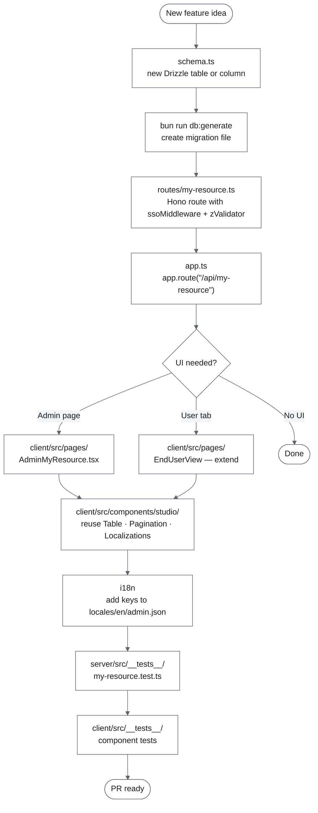

# Extending

How to add new features without breaking existing ones.

## Feature lifecycle overview

The diagram below shows the file touchpoints for a typical new resource — from schema to route to UI to test.



## Contents

- [The items demo as a reference](#the-items-demo-as-a-reference)
- [Adding a new API route](#adding-a-new-api-route)
- [Adding a new database table](#adding-a-new-database-table)
- [Adding a new UI page / route](#adding-a-new-ui-page--route)
- [Adding a tab to the user view](#adding-a-tab-to-the-user-view)
- [Adding a translation key](#adding-a-translation-key)
- [Adding a new customer](#adding-a-new-customer)
- [Adding a Studio compound component](#adding-a-studio-compound-component)
- [Styling a new frontend page](#styling-a-new-frontend-page)
- [Styling admin or studio components](#styling-admin-or-studio-components)
- [Changing the DB schema of an existing table](#changing-the-db-schema-of-an-existing-table)
- [Adding a new content locale](#adding-a-new-content-locale)
- [Replacing the items demo with your own domain](#replacing-the-items-demo-with-your-own-domain)
- [Extending the widget](#extending-the-widget)

---

## The items demo as a reference

The template ships a worked example: a generic `items` table + `/api/items` CRUD route + the Admin View built around it. Read it before adding your own domain — it covers every common pattern in one place:

| Concern                     | Where                                                                                                                                  |
| --------------------------- | -------------------------------------------------------------------------------------------------------------------------------------- |
| Tenant-scoped Drizzle table | [`server/src/db/schema.ts`](../../server/src/db/schema.ts) `items` + scopedDb predicate in [`scoped.ts`](../../server/src/db/scoped.ts) |
| List with search/sort/filter/paginate | [`server/src/routes/items.ts`](../../server/src/routes/items.ts) — `listQuerySchema`, `orderByFor`, dynamic `and(...conditions)` |
| Mutation + audit-log write  | Same file, `POST/PUT/DELETE` handlers calling `logChange()` after the DB write                                                          |
| GDPR purge integration      | [`server/src/lib/remote-calls.ts:deleteInstance`](../../server/src/lib/remote-calls.ts) includes `items` in its transaction             |
| Clear-all integration       | [`server/src/routes/admin.ts:clear-all`](../../server/src/routes/admin.ts) deletes `items` alongside `settings`                          |
| Localdev seed               | [`server/src/seed.ts`](../../server/src/seed.ts) + `/api/localdev/{seed,clear}` mounted only when `IS_LOCALDEV=true`                     |
| React Query + MSW           | [`client/src/components/admin/ItemsList.tsx`](../../client/src/components/admin/ItemsList.tsx) + handlers in [`msw-handlers.ts`](../../client/src/__tests__/msw-handlers.ts) |
| Design System composition   | [`AdminLayout`](../../client/src/components/admin/AdminLayout.tsx) — SegmentedControl + Search + Filter + Select; [`ItemsList`](../../client/src/components/admin/ItemsList.tsx) — Table + Pagination + Skeleton + EmptyState + Menu + Pill + AlertDialog |
| Form dialog                 | [`ItemForm`](../../client/src/components/admin/ItemForm.tsx) — Dialog + Field + TextField + TextArea + Select + SegmentedControl       |
| i18n keys                   | `tabs.*`, `category.*`, `sort.*`, `items-list.*`, `item-form.*` in every `client/src/locales/<lang>/admin.json`                          |
| Audit-log union extension   | `item_created` / `item_updated` / `item_deleted` actions + `item` entity type in [`server/src/lib/changelog.ts`](../../server/src/lib/changelog.ts) and [`client/src/types/api.ts`](../../client/src/types/api.ts) |

---

## Adding a new API route

### 1. Create the route file

```ts
// server/src/routes/my-resource.ts
import { Hono } from "hono";
import { zValidator } from "@hono/zod-validator";
import { z } from "zod";
import { ssoMiddleware, requireEditor } from "../middleware/sso.ts";
import type { AppEnv } from "../types/hono.ts";

const router = new Hono<AppEnv>();

// Apply SSO to all routes in this file
router.use("*", ssoMiddleware);

router.get("/", async (c) => {
  const { instanceId } = c.var.user;
  // Always filter by instanceId
  const rows = await db
    .select()
    .from(myTable)
    .where(eq(myTable.instanceId, instanceId));
  return c.json(rows);
});

router.post(
  "/",
  requireEditor,
  zValidator("json", z.object({ name: z.string().min(1) })),
  async (c) => {
    // ...
    return c.json(result, 201);
  },
);

export { router as myResourceRouter };
```

### 2. Register in `server/src/app.ts`

```ts
import { myResourceRouter } from "./routes/my-resource.ts";

// Add with the other api routes
app.route("/api/my-resource", myResourceRouter);
```

> **Route order:** If your route has a static segment that could conflict with an existing `/:id` param, mount the static route first (see the `/api/users/me` before `/api/users/:id` if applicable).

### 3. Validate the request body

Always use `zValidator("json", schema)` from `@hono/zod-validator` — never `c.req.json()` directly without schema validation.

### 4. Add logging

Use `createLogger` from `lib/logger.ts` — never use `console.*` in production code paths:

```ts
import { createLogger } from "../lib/logger.ts";

const logger = createLogger("my-resource"); // module name appears in every log line

// Inside a handler:
logger.info("Created resource.", { instanceId, resourceId: row.id });
logger.warn("Upstream returned non-2xx.", {
  "http.response.status_code": res.status,
});
logger.error("DB write failed.", { instanceId, message: err.message });
```

Keep `msg` strings **static** — put variable data in the second argument object. Field names follow OTel semantic conventions (`http.response.status_code`, `url.path`, etc.). See [logging.md](../reference/logging.md) for the full field reference.

### 4b. Add audit logging (mutation routes only)

If your route **creates, updates, or deletes** data, also call `logChange` from `lib/changelog.ts` so the action appears in the admin Activity Log:

```ts
import { logChange, buildUserName } from "../lib/changelog.ts";

// Inside a mutation handler (after the DB write):
void logChange({
  instanceId,
  userId: c.var.user.userId,
  userName: buildUserName(
    c.var.user.userId,
    c.var.user.firstName,
    c.var.user.lastName,
  ),
  action: "my_resource_created", // extend ChangelogAction if needed
  entityType: "app", // or "tag" | "settings" | "user" | "system"
  entityId: row.id,
  entityName: row.name,
  summary: `Resource '${row.name}' created by ${userName}.`,
  payload: { relevantField: value }, // optional detail shown in the UI
  gdprRelevant: false, // set true if action touches personal data
});
```

`logChange` is fire-and-forget — it never throws. If the write fails it logs to stderr and continues silently, so it will never break a successful API response.

> **GDPR rule:** If your action writes a user's personal data (email, name, token, etc.), set `gdprRelevant: true`. The entry will be highlighted in the Activity Log with a lock icon.

### 5. Write a test

#### Server route test

Add `server/src/__tests__/my-resource.test.ts`. Use the `chainResult` + `selectQueue` pattern:

```ts
import {
  afterEach,
  beforeAll,
  beforeEach,
  describe,
  expect,
  mock,
  test,
} from "bun:test";

mock.module("@staffbase/staffbase-plugin-sdk", () => ({
  sso: class {
    constructor(_a: string, _b: string, t: string) {
      if (!t || t === "invalid") throw new Error("Invalid token");
    }
    getTokenData() {
      return {
        getUserId: () => "user-1",
        getFullName: () => "Test User",
        getInstanceId: () => "dev-instance",
        getRole: () => "editor",
        // ... other getters
      };
    }
  },
}));

let selectQueue: unknown[][] = [];

function chainResult(value: unknown): unknown {
  const promise = Promise.resolve(value);
  return new Proxy(promise as object, {
    get(target, prop) {
      if (prop === "then" || prop === "catch" || prop === "finally")
        return (target as any)[prop].bind(target);
      return () => chainResult(value);
    },
  });
}

mock.module("../db/client.ts", () => ({
  db: {
    select: () => chainResult(selectQueue.shift() ?? []),
    insert: () => chainResult([]),
    update: () => chainResult([]),
    delete: () => chainResult([]),
  },
}));

let app: any;
beforeAll(async () => {
  app = (await import("../app.ts")).app;
});
beforeEach(() => {
  Bun.env.IS_LOCALDEV = "true";
});
afterEach(() => {
  selectQueue = [];
});

describe("GET /api/my-resource", () => {
  test("returns 200", async () => {
    selectQueue = [[{ id: "1", name: "Test" }]];
    const res = await app.request("/api/my-resource", { method: "GET" });
    expect(res.status).toBe(200);
  });
});
```

#### Client component test

Add `client/src/components/__tests__/MyComponent.test.tsx`:

```tsx
import { render, screen } from "@testing-library/react";
import { describe, expect, it } from "vitest";
import { renderWithProviders } from "../../__tests__/test-utils.tsx";
import { MyComponent } from "../MyComponent.tsx";

describe("MyComponent", () => {
  it("renders content", () => {
    renderWithProviders(<MyComponent />);
    expect(screen.getByText("Expected text")).toBeInTheDocument();
  });
});
```

Use MSW to mock API responses — see `client/src/__tests__/msw-handlers.ts` for default handlers.

#### E2E test

Add `e2e/my-feature.spec.ts`:

```ts
import { expect, test } from "@playwright/test";

test("my feature works end-to-end", async ({ page }) => {
  await page.goto("/");
  await page.waitForLoadState("networkidle");
  await expect(page.getByText("Expected content")).toBeVisible();
});
```

See [testing.md](./testing.md) for the full testing guide.

---

## Adding a new database table

### 1. Define the table in `server/src/db/schema.ts`

```ts
export const myTable = pgTable(
  "my_table",
  {
    id: uuid("id").primaryKey().defaultRandom(),
    instanceId: text("instance_id").notNull(), // ← always required
    name: text("name").notNull(),
    createdAt: timestamp("created_at").notNull().defaultNow(),
    updatedAt: timestamp("updated_at").notNull().defaultNow(),
  },
  (t) => [index("my_table_instance_id_idx").on(t.instanceId)],
);
```

**Every table must have `instance_id`.** This is non-negotiable — it is how multi-tenant isolation works.

### 2. Generate and apply the migration

```bash
cd server
bun run generate   # creates a new SQL file in src/db/migrations/
bun migrate        # applies it to the local database
```

Review the generated SQL before committing it.

---

## Adding a new UI page / route

### 1. Create the page component

```tsx
// client/src/pages/MyPage.tsx
import { useI18n } from "@/hooks/useI18n";

export default function MyPage() {
  const { t } = useI18n();
  return <div>{t("my-page.title")}</div>;
}
```

### 2. Register the route in `client/src/App.tsx`

```tsx
import MyPage from "./pages/MyPage.tsx";

// Inside <Routes>:
<Route path="/my-page" element={<MyPage />} />;
```

### 3. Add a server HTML route (if needed)

If the page needs a dedicated server-rendered entry (with JWT injection), add it to `server/src/routes/html.ts` following the existing `/`, `/admin`, `/dev` pattern. Remember to add the editor guard (`requireEditor`) if it should be editor-only.

---

## Adding navigation to the user view

`EndUserView` (`client/src/pages/EndUserView.tsx`) is the user-facing entry point — a single placeholder by default. When you need multiple routes/views:

1. Either add new top-level `<Route>` entries in `client/src/App.tsx` and create the page components in `client/src/pages/`, or build an in-page tab system using `<SegmentedControl>` from `@staffbase/design` inside `EndUserView` itself.
2. Add a server HTML route for any new top-level path (so JWT injection works), following the `/` and `/admin` handlers in `server/src/routes/html.ts`.
3. Add the translation keys to all 5 locale files (see below).

---

## Adding a translation key

### 1. Decide which namespace

| Namespace   | Covers             | Hook             |
| ----------- | ------------------ | ---------------- |
| `template` | All user-facing UI | `useI18n()`      |
| `admin`     | Admin panel only   | `useAdminI18n()` |

### 2. Add to all 5 locale files

Always add to the **English file first** (canonical source), then copy to all others:

```
client/src/locales/en/template.json   ← add here first
client/src/locales/de/template.json
client/src/locales/es/template.json
client/src/locales/fr/template.json
client/src/locales/pl/template.json
```

TypeScript will catch missing keys because `i18next.d.ts` is augmented from the English file. A missing key in English is a compile error; a missing key in other languages silently falls back (in dev) or shows nothing (in production).

### 3. Use in a component

```tsx
import { useI18n } from "@/hooks/useI18n";
// or
import { useAdminI18n } from "@/hooks/useAdminI18n";

const { t } = useI18n();
return <p>{t("my-section.my-key")}</p>;
```

---

## Adding a new customer

Each customer is identified by the `branch_slug` claim in their Staffbase JWT.

### 1. Create the customer theme

Add `client/public/customers/{branch_slug}/theme.css` with `:root { --brand-* }` overrides and optional `@font-face` rules:

```css
@font-face {
  font-family: "Acme Sans";
  src: url("https://cdn.example.com/acme-sans.woff2") format("woff2");
  font-weight: 400;
  font-display: swap;
}

:root {
  --brand-font: "Acme Sans", Inter, sans-serif;
  --brand-color-primary: #1a3c6e;
  --brand-color-link: #e8500a;
  --brand-color-link-hover: #c4420a;
  /* Omit tokens to keep the _default fallback values */
}
```

Vite copies `client/public/` verbatim to `dist/public/` — the file is available at build time without any config change. The server reads it at runtime via `readCustomerTheme(slug)`.

### 2. (Optional) Override React client translation strings

Create `client/src/customers/{branch_slug}/locales/{lang}/{namespace}.json` with only the keys that differ:

```
client/src/customers/acme/locales/en/template.json
client/src/customers/acme/locales/de/template.json
```

```json
{
  "tabs": {
    "all-apps": "All Tools"
  }
}
```

Only keys present in these files override defaults. The rest falls through to the standard locale files.

### 3. (Optional) Override widget translation strings

The widget ships with the same five UI locales as the admin and client (`en_US`, `de_DE`, `es_ES`, `fr_FR`, `pl_PL`). Every user-visible string is a key on the `Translations` type in `widget/src/i18n.ts` — there are no inline literals in the render, widget, picker, or configuration-schema modules. Customers can override any subset of those keys per locale.

Create `client/public/customers/{branch_slug}/i18n.json` with per-locale partial overrides, nested under a `"widget"` namespace key:

```json
{
  "widget": {
    "en_US": {
      "empty": "No pinned apps yet."
    },
    "de_DE": {
      "empty": "Noch keine angehefteten Apps."
    }
  }
}
```

Overridable keys under `"widget"` (see `widget/src/i18n.ts` for the authoritative list):

| Group | Keys |
| --- | --- |
| Viewer lifecycle | `loading`, `error`, `empty`, `openApp` |
| Viewer pagination | `pagerPrev`, `pagerNext`, `pagerStatus` (supports `{page}` / `{total}`) |
| Viewer config errors | `installationRequired`, `installationInvalid`, `serverUrlUnavailable`, `unknownError` |
| Editor — installation picker | `pickerPlaceholder`, `pickerLoading`, `pickerLoadingWithId` (supports `{id}`), `pickerNoResults`, `pickerError`, `pickerServerUrlMissing` |
| Editor — config schema | `configInstallationTitle`, `configInstallationDescription`, `configMaxItemsTitle`, `configMaxItemsDescription`, `configMaxItemsHelp` |

Only include the keys you want to override — the rest keep their built-in defaults. The namespace structure leaves room to add overrides for other parts of the plugin in the same file in the future. The server extracts the `"widget"` namespace before sending `translationOverrides` to the widget, so the widget's internal `getTranslations()` API is unchanged.

**Scope note:** Viewer-facing states pick overrides up at runtime from the catalog response. The installation picker and the configuration-schema titles/descriptions are resolved once at bundle-load against the fallback locale (the Studio editor runs before the catalog fetch, so `translationOverrides` can't reach it there) — they're still centralized in `i18n.ts` as the single source of truth.

### 4. Test locally

Set `LOCALDEV_BRANCH_SLUG=acme` (or the customer's actual slug) in `.env` and restart the server. The injected `<style id="customer-theme">` in the page source confirms the theme is being applied.

---

## Adding a Studio compound component

Studio components (`client/src/components/studio/`) are adapted from [`experience-studio`](https://github.com/Staffbase/experience-studio). They are **presentation-only** — no data fetching, no API calls.

To add a new one:

1. Copy the source from `experience-studio/libs/components/` (or `apps/main/src/components/`)
2. Replace `@exs/routing`'s `NavLink` with `react-router-dom`'s `NavLink` — the API is identical
3. Replace any `@exs/*` imports with local equivalents or remove them
4. Place the file in `client/src/components/studio/`
5. No new npm dependencies — studio components use only Tailwind + `@staffbase/design` which are already installed

Once wired up, the new section appears in the admin panel alongside the existing Apps and Tags tables. See the [Visual Tour](../reference/visual-tour.md) for example screenshots of the Studio-pattern layout (header bar, search row, paginated table, action column) shared by every admin section.

---

## Styling a new frontend page

Frontend pages (`pages/`, `layouts/`, `pages/EndUserView`) use the customer brand token palette.

**Typography:**

- Add `font-brand` only to the **root `<div>` of a new user-facing layout** (e.g. a new standalone page with its own `<div className="min-h-screen ... font-brand">`). It propagates to all children via inheritance.
- Never add `font-brand` to individual inner components or admin/studio components.

**Color classes:**

All values resolve at runtime via CSS variables set by the active customer theme in `client/public/customers/{branch_slug}/theme.css`.

| Purpose                     | Class                                                             |
| --------------------------- | ----------------------------------------------------------------- |
| Nav / header background     | `bg-brand-primary`                                                |
| Buttons, links, interactive | `bg-brand-link` / `text-brand-link`                               |
| Button / link hover         | `hover:bg-brand-link-hover` / `hover:text-brand-link-hover`       |
| Headings, strong text       | `text-brand-secondary`                                            |
| Descriptions, metadata      | `text-brand-muted`                                                |
| Page background             | `bg-brand-surface`                                                |
| Card / input borders        | `border-brand-border`                                             |
| Success / warning / danger  | `text-brand-success` / `text-brand-warning` / `text-brand-danger` |

**Icons:**

All action icons in user-facing views come from `@staffbase/design` — never use inline SVGs. Import the icon component and size it with a Tailwind font-size token (`text-20`, `text-24`, etc.) since design-system icons render at `width="1em" height="1em"`. Color is inherited via `currentColor`, so standard text-color classes (`text-neutral-medium`, `text-brand-link`, etc.) work.

```tsx
import { InfoIcon, OpenOutIcon, StarIcon, StarAltIcon, EditIcon, CloseIcon } from "@staffbase/design";

// Card action (16px) — use text-16 and p-2 for comfortable mobile tap targets
<button className="p-2 text-16 text-neutral-medium hover:text-neutral-strong">
  <InfoIcon />
</button>

// Detail/panel action (20px)
<button className="p-2 text-20 text-neutral-medium hover:text-neutral-strong">
  <CloseIcon />
</button>

// Favorite toggle — swap between outline (StarIcon) and filled (StarAltIcon)
{isFavorited ? <StarAltIcon /> : <StarIcon />}
```

**Shape and header conventions:**

- Use `rounded-none` everywhere — sharp corners are a defining Daimler visual trait
- Top-bar / page headers: `bg-brand-primary text-white`
- Buttons: `bg-brand-link hover:bg-brand-link-hover text-white rounded-none`

**Example skeleton:**

```tsx
export default function MyFeaturePage() {
  return (
    <div className="min-h-screen bg-brand-surface font-brand">
      <header className="bg-brand-primary px-4 py-4">
        <h1 className="text-display text-white">My Feature</h1>
      </header>
      <main className="p-4">
        <button className="bg-brand-link hover:bg-brand-link-hover text-white rounded-none px-4 py-2">
          Action
        </button>
      </main>
    </div>
  );
}
```

---

## Styling admin or studio components

Admin components (`components/admin/*`) and Studio primitives (`components/studio/*`) always use the **Staffbase Design System** tokens and components. They must look native to the Staffbase platform regardless of the customer's brand.

**Components — use `@staffbase/design` primitives, not native HTML controls.** Storybook lives at <https://design.staffbase.rocks/>.

| Native HTML                                                      | Design-system replacement                                 |
| ---------------------------------------------------------------- | --------------------------------------------------------- |
| `<select>`                                                       | `Select.Root` / `SingleSelect` / `SearchableSingleSelect` |
| `<input type="checkbox">`                                        | `Checkbox` / `CheckboxGroup`                              |
| `<input type="radio">`                                           | `Radio` / `RadioGroup`                                    |
| `<input type="text\|email\|url\|search\|tel\|password\|number">` | `TextField` (or `NumberStepper` for stepper UX)           |
| `<textarea>`                                                     | `TextArea`                                                |
| `<hr>`                                                           | `Divider`                                                 |

Enforced by `scripts/lint-design-system.ts`, which runs as part of `bun run check` and can be invoked standalone with `bun run check:design-system`. Violations under `client/src/components/admin/` and `client/src/pages/AdminView.tsx` fail the build with the offending file, line, and suggested replacement. Add new bans to the `RULES` array in that script when drift is spotted — keep the list selective (no blanket `<button>` / `<input>` ban, since trailing-icon buttons inside `Field.Root` and hidden file inputs wrapped in accessible drag-drop labels are legitimate).

**Token conventions (mirror experience-studio):**

| Purpose                 | Class                 |
| ----------------------- | --------------------- |
| Panel / card background | `bg-neutral-surface`  |
| Page / app background   | `bg-neutral-base`     |
| Dividers, input borders | `border-neutral-weak` |
| Primary text            | `text-neutral-strong` |
| Secondary / muted text  | `text-neutral-medium` |
| Corner radius           | `rounded-8`           |
| Section padding         | `px-40 py-24`         |
| Row padding             | `px-24 py-12`         |

**Never apply `brand-*` classes or `font-brand` in admin or studio components.** This boundary is a permanent architectural decision.

---

## Changing the DB schema of an existing table

1. Edit `server/src/db/schema.ts`
2. Run `cd server && bun run generate` to create the migration
3. Run `bun migrate` locally and verify the output
4. If the migration alters a column with existing data (e.g. type change), write the migration manually or review the generated SQL carefully — Drizzle Kit may generate a destructive migration
5. Commit both the schema change and the migration SQL file together

---

## Adding a new content locale

Content locales are the languages an app's metadata (name, descriptions, link) can be translated into. These are separate from UI languages.

> **Platform requirement:** Content locales come from the Staffbase branch configuration, queried via `getBranchLanguages()` in `@staffbase/plugins-client-sdk`. For a new locale to appear in the branch language picker, it must first be configured in the Staffbase platform. No code change in this repository is required for the branch to expose it.

1. No code changes needed — the DB stores jsonb and accepts any locale key
2. If the new locale should appear in the language picker in your localized form component, add it to `client/src/utils/contentLanguages.ts` with its native display name
3. The `Localizations` component will automatically render a tab for it when it is added to an app's `languages` array

---

## Replacing the items demo with your own domain

When your real domain takes shape and you want the worked example out of the way:

1. **Schema** — rename or drop `items` in [`server/src/db/schema.ts`](../../server/src/db/schema.ts). Add your own table(s) with the same `instance_id`-first shape. Generate the migration: `cd server && bun drizzle-kit generate`.
2. **Scoped predicates** — update [`server/src/db/scoped.ts`](../../server/src/db/scoped.ts) to drop `items` (or replace with your table). Same for [`client.ts`](../../server/src/db/client.ts) schema import block.
3. **GDPR purge** — drop the `items` line in [`server/src/lib/remote-calls.ts:deleteInstance`](../../server/src/lib/remote-calls.ts) (or replace with your table). Mirror in [`server/src/routes/admin.ts:clear-all`](../../server/src/routes/admin.ts).
4. **Route** — delete [`server/src/routes/items.ts`](../../server/src/routes/items.ts) (or rename it). Drop the mount line in [`app.ts`](../../server/src/app.ts).
5. **Seed** — edit [`server/src/seed.ts`](../../server/src/seed.ts) to seed your own entity. Keep the file even if you drop sample data — `/api/localdev/{seed,clear}` route into it.
6. **Audit-log union** — narrow `ChangelogAction` in [`server/src/lib/changelog.ts`](../../server/src/lib/changelog.ts) to drop `item_*` actions (add your own). Mirror in [`client/src/types/api.ts`](../../client/src/types/api.ts) and the `ACTION_PILL_VARIANT` map in [`ChangelogDialog.tsx`](../../client/src/components/admin/ChangelogDialog.tsx).
7. **Client list + form** — rewrite [`ItemsList.tsx`](../../client/src/components/admin/ItemsList.tsx) and [`ItemForm.tsx`](../../client/src/components/admin/ItemForm.tsx) for your shape, or replace them with new files and update [`AdminView.tsx`](../../client/src/pages/AdminView.tsx) wiring.
8. **AdminLayout** — the layout is reusable as-is (SegmentedControl status tabs + search + category filter + sort). If your domain has no statuses, drop the `<SegmentedControl>` block; if no categories, drop the `<Filter>`.
9. **Locales** — drop the items-specific groups from every `client/src/locales/<lang>/admin.json`: `tabs.*`, `category.*`, `sort.*`, `items-list.*`, `item-form.*`, `add-item-btn`, `search-items`, `item-count_*`, `status-tabs-aria`, `changelog.action-item-*`, `changelog.filter-items`. Add your own keys.
10. **MSW handlers** — drop `/api/items` and `/api/items/categories` from [`client/src/__tests__/msw-handlers.ts`](../../client/src/__tests__/msw-handlers.ts).
11. **Tests** — update `client/src/components/admin/__tests__/*` (none currently target items by name) and add new ones for your components.
12. **DevView** — Seed/Clear buttons are domain-agnostic; they keep working as long as `seed.ts` does. No change needed.

The infrastructure pieces (sessions, settings, changelog, users, GDPR delete) **stay** — they are the reason this template exists. Only the demo `items` layer is meant to be replaced.

---

## Extending the widget

The widget ships with a working **installation picker** so editors bind each widget instance to the right plugin installation. Adding new config fields is a three-place change:

1. **Schema property** — add the field to `configurationSchema.properties` in [`widget/src/configuration-schema.ts`](../../widget/src/configuration-schema.ts) with `type`, `title`, `description`, and optional `default`. Add it to the `required` array if mandatory.
2. **UI hint** — add a `uiSchema` entry if you want a non-default RJSF widget (`ui:widget: "updown"` for numbers, `ui:widget: "checkbox"` for booleans, or a custom React component for richer pickers — see [`installation-picker.tsx`](../../widget/src/installation-picker.tsx) for the pattern).
3. **Manifest attributes** — list every attribute name in [`widget/manifest.json`](../../widget/manifest.json) `bundles[0].attributes` AND in the auto-derived `WIDGET_ATTRS` array (it derives from `configurationSchema.properties`, so re-running `bun run build` is enough if you only added to `properties`).

Then in [`widget/src/widget.ts`](../../widget/src/widget.ts):

- Add the attribute to `attributeChangedCallback` triggers — `WIDGET_ATTRS` already includes it.
- Read it with `this.getAttribute("your_field")` inside `_render()`.

Custom RJSF widgets (like the installation picker) need:

- A React class or function component with `{ value, onChange, formContext, disabled, readonly, id }` props.
- Pass it as the `"ui:widget"` value in `uiSchema`.
- Avoid heavy dependencies — the bundle ships to every Staffbase page.

To verify locally, run `bun run preview` inside `widget/` and edit the attribute input field in the preview shell (`widget/preview/index.html`). For full picker E2E you need a real Staffbase tenant (`/api/plugins/{pluginId}/installations/search` is a Staffbase platform endpoint that cannot be mocked locally).

When you rename the widget bundle (the `bundleBaseName` in [`widget/scripts/build.ts`](../../widget/scripts/build.ts)), update the same string in [`widget/src/plugin-url.ts`](../../widget/src/plugin-url.ts) (`BUNDLE_FILENAME`) so the DOM-scan fallback for resolving `PLUGIN_URL` still works in WKWebView environments.
