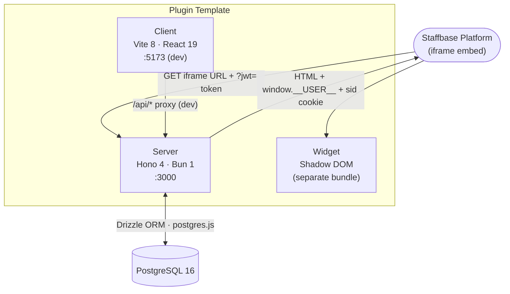

# Plugin Template Documentation

Welcome to the Plugin Template documentation. This folder contains the infrastructure-level reference docs that ship with the template — covering session handling, GDPR, database, i18n, logging, and deployment. Replace and extend them as you build out plugin-specific features.

## 📚 Documentation Structure

**Guides** — how to do things

- **[Local Development](guides/local-development.md)** — Docker setup, env vars, URL params, Vite proxy
- **[Testing](guides/testing.md)** — three-tier test suite (server · client · E2E), role-based fixtures, patterns
- **[Extending](guides/extending.md)** — how to add routes, tables, pages, translation keys, and Studio components
- **[Template sync](guides/template-sync.md)** — evolve the template, then roll improvements out to existing custom plugins via DRAFT PRs + the `dev` label

**Architecture** — how the system is built

- **[Overview](architecture/architecture.md)** — project structure, auth flow, RBAC, multi-tenancy, component hierarchy, and CI/CD
- **[Database](architecture/database.md)** — schema, columns, indexes, migration history, Drizzle config
- **[Sessions](architecture/sessions.md)** — hybrid cookie-first/JWT-fallback auth flow, GDPR compliance, session lifecycle, and user identity
- **[GDPR hardening](architecture/gdpr-hardening.md)** — three-layer user lifecycle (per-request gate + per-render fan-out + background sweep), transactional purge, threat scenarios, mermaid diagrams
- **[i18n](architecture/i18n.md)** — UI language (i18next) vs content language, admin language switching, and adding locales

**Reference** — lookup material

- **[API Reference](reference/api.md)** — full endpoint reference, auth requirements, request/response shapes, and localdev-only routes
- **[Logging](reference/logging.md)** — structured JSON logging, log levels, env vars, and localdev verbose mode
- **[Log catalog](reference/log-catalog.md)** — production line-by-line reference: what each warn/info means, when it's actionable, common Grafana queries

**Architecture Decision Records**

- **[ADRs](adrs/)** — ADR-0001 through ADR-0013 (latest: logging contract, strict-GDPR user lifecycle, user cache lifecycle)

## 🚀 What is this template?

A production-grade Staffbase Custom Plugin starter. Ships with all the boring-but-critical infrastructure already wired up — SSO, GDPR delete handling, session management (with Safari ITP workaround), per-tenant settings with encrypted API tokens, audit log, structured logging, multi-tenant DB isolation, multi-language i18n, error boundary, theme injection, CSP frame-ancestors — plus:

- a **worked Admin View** built around a generic `items` table that demonstrates the full Design System composition (Table, Pagination, SearchInput, Filter dropdown, Select sort, SegmentedControl tabs, EmptyState, Skeleton, Pill, Menu, AlertDialog, Dialog, Field, TextField, TextArea) wired to a CRUD route with audit-log + GDPR integration. Replace the items domain, keep the patterns.
- an **empty End User View** ready for plugin-specific UI.
- a **widget** (Shadow DOM custom element via `@staffbase/widget-sdk`) with a working **installation picker** so editors can bind each widget instance to the correct plugin installation when the same plugin is installed multiple times on one tenant.
- a **localdev seed/clear** flow on `/dev` so the demo Admin View has data on first run.

## 🏗️ Service Architecture



## 🔧 Technology Stack

- **Runtime / Package Manager**: Bun 1.x
- **HTTP Framework**: Hono 4
- **Frontend**: React 19 · Vite 8 · Tailwind CSS 4 · `@staffbase/design`
- **Widget**: `@staffbase/widget-sdk` · Shadow DOM
- **Database**: PostgreSQL 16
- **ORM**: Drizzle ORM + `postgres.js`
- **Validation**: Zod + `@hono/zod-validator`
- **Auth**: `@staffbase/staffbase-plugin-sdk` (server JWT) · `@staffbase/plugins-client-sdk` (client)
- **State / Data Fetching**: TanStack Query v5
- **Code Quality**: Biome (lint + format)
- **Tests**: `bun test` (server) · Vitest + MSW (client) · Playwright (E2E + a11y)
- **Containerisation**: Multi-stage Dockerfile (`oven/bun:1-alpine` → `oven/bun:1-distroless`)
- **CI/CD**: GitHub Actions — lint → test → build → push

## 🚀 Quick Start

```bash
export NPM_TOKEN=<your-token>
bun install
bun run dev
```

This starts Docker (Postgres), applies migrations, and launches both the Hono server and Vite dev server.

| Check              | URL                                                     |
| ------------------ | ------------------------------------------------------- |
| API health         | `curl http://localhost:3000/health` → `{"status":"ok"}` |
| End user view      | `http://localhost:5173/`                                |
| Admin view (demo)  | `http://localhost:5173/admin`                           |
| Dev tools          | `http://localhost:5173/dev` — Seed / Clear buttons      |
| pgweb (DB browser) | `http://localhost:8081`                                 |

First time? Click **Seed sample data** on `/dev`, then open `/admin` to see the items demo (17 active, 3 archived, filter + sort + paginate).

## 📖 Additional Resources

- Main repository [README.md](../README.md) — development setup, rename checklist, troubleshooting
- [`.env.example`](../.env.example) — environment variable reference
- [AGENTS.md](../AGENTS.md) — AI agent constraints and guidance
