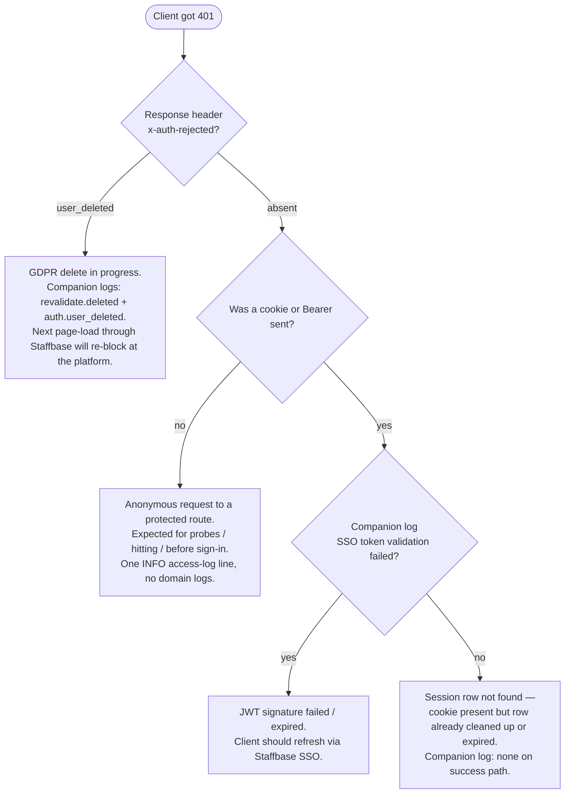

# Log catalog — production log lines explained

Companion to [ADR-0013 (logging contract)](../adrs/0013-logging-contract.md)
and [GDPR hardening](../architecture/gdpr-hardening.md).

This page is the **production line-by-line reference**: when you see a log
in Grafana / Victoria Logs, find it here to understand what triggered it,
whether it's actionable, and what to do about it. Examples below come
directly from `cc-custom-plugin-glossary` and `cc-custom-plugin-applaunchpad`
in dev/de1.

Open in Grafana:

- [Glossary logs (observatory-de1)](https://observatory-de1.staffbase.dev/explore?schemaVersion=1&panes=%7B%220kd%22:%7B%22datasource%22:%22victorialogs%22,%22queries%22:%5B%7B%22refId%22:%22A%22,%22datasource%22:%7B%22type%22:%22victoriametrics-logs-datasource%22,%22uid%22:%22victorialogs%22%7D,%22editorMode%22:%22code%22,%22expr%22:%22k8s.namespace.name%20:%3D%20%5C%22cc-custom-plugin-glossary%5C%22%22,%22queryType%22:%22instant%22%7D%5D,%22range%22:%7B%22from%22:%22now-15m%22,%22to%22:%22now%22%7D%7D%7D&orgId=1)
- [Applaunchpad logs (observatory-de1)](https://observatory-de1.staffbase.dev/explore?schemaVersion=1&panes=%7B%220kd%22:%7B%22datasource%22:%22victorialogs%22,%22queries%22:%5B%7B%22refId%22:%22A%22,%22datasource%22:%7B%22type%22:%22victoriametrics-logs-datasource%22,%22uid%22:%22victorialogs%22%7D,%22editorMode%22:%22code%22,%22expr%22:%22k8s.namespace.name%20:%3D%20%5C%22cc-custom-plugin-applaunchpad%5C%22%22,%22queryType%22:%22instant%22%7D%5D,%22range%22:%7B%22from%22:%22now-15m%22,%22to%22:%22now%22%7D%7D%7D&orgId=1)

---

## Schema

Every line is a JSON object. Key fields:

| Field | Meaning |
|-------|---------|
| `_msg` | Human-readable summary. **Use this to grep**, not the raw line. |
| `severity` | `INFO` / `WARN` / `ERROR` / `DEBUG` / `TRACE`. |
| `module` | Stable subsystem name from `createLogger("<module>")`. See ADR-0013 for the full table. |
| `event` | Dot-namespaced event id (`<module>.<action>[.<outcome>]`). Stable; use this in dashboards. |
| `instanceId` | Tenant (Staffbase installation). Present on every authenticated path. |
| `userId` | Authenticated user. **Intentionally absent** on GDPR-deletion rejects (see below). |
| `http.*` | OTel-shape HTTP fields when relevant. |
| `service.name`, `k8s.*` | OTel + k8s resource attrs from the OTel collector. |

For the rules behind which lines exist and at what level, read
[ADR-0013](../adrs/0013-logging-contract.md). This page is the operational
cookbook on top.

---

## The three lines that prompted this page

These three lines appear regularly in `cc-custom-plugin-glossary` and
`cc-custom-plugin-applaunchpad` and have specific meanings:

### `info GET / → 401 (1ms)`

```json
{
  "_msg": "GET / → 401 (1ms)",
  "module": "http",
  "severity": "INFO",
  "http.request.method": "GET",
  "url.path": "/",
  "http.route": "/",
  "http.response.status_code": "401",
  "http.request.duration": "1"
}
```

**What it is.** The standard HTTP access-log emitted by
[`server/src/middleware/access-log.ts:140`](../../server/src/middleware/access-log.ts).
One line per non-probe request, with method + matched route + status +
wall-clock duration.

**Why `GET / → 401`.** The root path `/` requires authentication. Anything
hitting it without a valid session cookie or `?jwt=` parameter gets 401
from `ssoMiddleware` ([`sso.ts:517`](../../server/src/middleware/sso.ts) —
`return c.text("Unauthorized", 401)`).

The recurring source in dev/de1 is **anonymous probes**:

- ~ every 4 minutes, evenly across all replicas (`pod.name` rotates each
  hit — load-balanced across the deployment),
- 0-1 ms duration,
- no `x-request-id`, no `userId`, no `instanceId`,
- not from `/health` or `/probe` (those would be filtered by `SKIP_PATHS`
  in [`access-log.ts:35`](../../server/src/middleware/access-log.ts)).

This pattern matches Cloudflare / Istio external-uptime probes that hit
the public ingress at `/` (rather than the carve-out `/health` /
`/probe`). It is **not actionable** — the gate is working as designed:
unauthenticated request → 401.

**When this would be actionable.**

- The rate jumps (e.g. > 10/sec sustained): something is hammering the
  ingress unauthenticated. Cross-reference with `http_requests_total{
  status="401"}` in Prometheus to spot a runaway client or scanner.
- The same `x-request-id` repeatedly retries: a client is misconfigured
  and not following auth redirects. Look at the upstream Istio access log
  for the source IP.
- `http.request.duration` > 50 ms: 401 should be sub-millisecond. A slow
  401 means SSO middleware is doing more work than it should (e.g.
  reaching upstream Staffbase on an obvious-anonymous path).

**Why this isn't `severity: WARN`.** The HTTP access log is a uniform
INFO regardless of status code (see [ADR-0013 §"What does NOT change"](../adrs/0013-logging-contract.md)).
WARN/ERROR are reserved for *domain* logs (the handler's own event line)
because access logs would otherwise drown out signal in WARN dashboards.

---

### `warn Accessor revalidation: user deleted upstream.`

```json
{
  "_msg": "Accessor revalidation: user deleted upstream.",
  "module": "user-cache",
  "severity": "WARN",
  "event": "revalidate.deleted",
  "instanceId": "6a0f061ac8d497353c58143b",
  "userId": "63a374f9fbfcee3bee21121a"
}
```

**Source:** [`server/src/lib/user-cache.ts:441`](../../server/src/lib/user-cache.ts)
in `_revalidateAccessor()`. Also emitted at
[`user-cache.ts:467`](../../server/src/lib/user-cache.ts) with the
suffix "flagged deleted upstream" when Staffbase returns `200 + { deleted: true }`
rather than `404`. Same `event: revalidate.deleted` — alert on the event
field, not the message.

**What it means.** The Layer 1 gate (see
[GDPR hardening](../architecture/gdpr-hardening.md#2-layer-1--per-request-accessor-gate))
just asked Staffbase whether `userId` still exists in `instanceId`,
got back `404` (or `deleted:true`), and **ran the
[`cleanupDeletedUser`](../../server/src/lib/remote-calls.ts) transaction**.
The next request from that user will be rejected as `401 user_deleted`,
their cookie is already deleted, their cache row is gone.

**Why this is WARN, not ERROR.** It's a confirmed-deleted user — a normal
GDPR outcome, not a failure. WARN is the right level so it stays visible
to ops without paging.

**Companion line.** Always paired immediately before with the underlying
upstream 404 (next entry):

```json
{ "_msg": "API response error.", ... "http.response.status_code": "404",
  "url.path": "/api/users/63a374f9fbfcee3bee21121a" }
```

So one delete produces exactly two warns: the API client warn (404) +
the user-cache warn (cleanup done). Both are expected.

**The repeating pattern in glossary dev/de1.** The same `userId =
63a374f9fbfcee3bee21121a` on `instanceId = 6a0f061ac8d497353c58143b`
re-fires every ~ few minutes. Reading the cache pipeline:

1. The user was deleted upstream — the warn fired once, `cleanupDeletedUser`
   ran. `users` row removed, sessions cleared, changelog nullified.
2. A subsequent reference fan-out (Layer 2) sees this userId still
   appearing in some other table — likely the `items.created_by_user_id`
   foreign key, where the row was not nullified (changelog is the only
   table whose `user_id` we nullify; domain tables keep the FK and rely
   on the LEFT JOIN going null after `users` row deletion).
3. `revalidateAccessor` runs again, hits `revalidate.upstream_error`? No
   — the negative cache would suppress that. It actually hits the warm
   `ACCESSOR_VERIFIED_CACHE` path normally. The repeat is from a
   different request whose Layer 2 stale window has elapsed (`>= 5 min`
   since the last verification). So every 4-5 minutes, a render that
   touches the deleted userId triggers another upstream check → 404 →
   warn pair → no-op `cleanupDeletedUser` (idempotent — rows already gone).

This is **expected behaviour for a referenced-but-deleted user**. The
plugin keeps the `items.created_by_user_id` FK so the audit history stays
intact; `getOwnerDisplayName()` ([`client/src/utils/locale.ts`](../../client/src/utils/locale.ts))
is the render site — ADR-0011's contract requires this helper to return
the `user-unknown` i18n string (never a raw userId) when the LEFT JOIN
goes null.

**When this would be actionable.**

- The same userId fires > 10×/hour: something is rendering the deleted
  user in a tight loop. The Layer 2 TTL should suppress this — check
  `USER_REFERENCE_REVALIDATE_SECONDS`.
- A different userId fires every few minutes: that's a separate
  deleted user. Pattern is identical.
- The userId field is present on `auth.user_deleted` (separate event):
  bug in the log shape — `auth.user_deleted` must NOT carry userId
  ([`sso.ts:334`](../../server/src/middleware/sso.ts) explicitly omits it).

**To find every delete event for an instance:**

```
k8s.namespace.name:="cc-custom-plugin-glossary"
AND event:="revalidate.deleted"
AND instanceId:="6a0f061ac8d497353c58143b"
```

---

### `warn API response error.`

```json
{
  "_msg": "API response error.",
  "module": "api",
  "severity": "WARN",
  "http.request.method": "GET",
  "url.path": "/api/users/63a374f9fbfcee3bee21121a",
  "http.response.status_code": "404",
  "instanceUrl": "https://ccmaxdev.staffbase.dev"
}
```

**Source:** [`server/src/lib/staffbase-api.ts:122-128`](../../server/src/lib/staffbase-api.ts).

**What it means.** The outbound Staffbase API client (`staffbaseFetch`)
got a non-OK response. WARN at this layer regardless of status code —
the API client is dumb to the caller's semantics; it just reports what
happened. Whether 404 is expected (deleted-user check) or unexpected
(bug in plugin code asking for a non-existent endpoint) depends on
**`url.path`** in the same log line:

| `url.path` pattern | Status | Meaning |
|--------------------|--------|---------|
| `/api/users/<id>` | 404 | Almost always a deleted user — paired with `revalidate.deleted` warn. Normal. |
| `/api/users/<id>` | 401 | Stale or rotated apiToken for this instance. The plugin keeps allowing the user (fail-open) until next request; settings PUT will rotate the cache. |
| `/api/users/<id>` | 429 | Staffbase rate limit hit. Negative cache (10 s) backs off automatically. |
| `/api/users/<id>` | 5xx | Staffbase outage. Same negative-cache backoff. Plugin fails open. |
| Anything else | 4xx/5xx | Caller-specific bug. Check the route that calls the API client. |

`instanceUrl` is included so multi-tenant incidents are easy to scope
("is this happening to one customer or all of them?").

**Why is the duplicate count of `API response error` lines > the
`revalidate.deleted` count?** Background `refreshAllUsers()` also calls
`/api/users/:id` for every cached user — a deleted user's row is removed
on the first sweep that sees the 404, but a 404 also fires from the next
Layer 1 / Layer 2 trigger that arrived before the sweep finished. Both
emit the API-client warn; only the path that actually ran the cleanup
also emits `revalidate.deleted`. Idempotent.

---

## Common queries

### "Has anything bad happened in the last 15 min?"

```
k8s.namespace.name:="cc-custom-plugin-template"
AND (severity:WARN OR severity:ERROR)
AND NOT event:="revalidate.deleted"
AND NOT event:="auth.user_deleted"
AND NOT _msg:="API response error."
```

The exclusions strip the three normal-operation lines documented above
so you only see things you should look at.

### "What is happening on this single request?"

```
k8s.namespace.name:="cc-custom-plugin-template"
AND http.request.header.x-request-id:="<id-from-istio>"
```

The `x-request-id` is forwarded from the Istio ingress all the way through
to outbound Staffbase API calls (`staffbase-api.ts` extracts and forwards
W3C trace context + this header), so one ID surfaces every line in the
request's path.

### "Did this user get rejected as deleted?"

```
k8s.namespace.name:="cc-custom-plugin-template"
AND event:="auth.user_deleted"
AND instanceId:="<instance>"
```

(Note no `userId` — it's intentionally stripped from this event.)

### "What's our 401 rate look like?"

```
k8s.namespace.name:="cc-custom-plugin-template"
AND http.response.status_code:="401"
| stats count() by http.route
```

Anonymous probes show up as `http.route="/"`; legitimate session-expiry
rejections show up as `http.route="/api/*"`.

---

## HTTP status-code playbook (cross-env)

Measured 2026-05-23 across all three prod regions + stage + dev for the
two downstream plugins. Use this to calibrate dashboards and silence
choices.

### What we see across the fleet

| Env | Plugin | 200 | 201 | 204 | 401 | 404 | 409 | 500 |
|-----|--------|-----|-----|-----|-----|-----|-----|-----|
| prod-de1 (30d) | applaunchpad | 39,311 | 126 | 87 | **18,655** | **23,145** | 2 | 0 |
| prod-de1 (30d) | glossary | 222 | 3 | 1 | 426 | 62 | — | — |
| prod-au1 (30d) | applaunchpad | 48 | — | — | **18,327** | **16,421** | — | — |
| prod-au1 (30d) | glossary | 1 | — | — | 392 | 21 | — | — |
| prod-us1 (30d) | applaunchpad | 107 | — | — | **18,264** | **18,083** | — | — |
| prod-us1 (30d) | glossary | 1 | — | — | 400 | 64 | — | — |
| stage-de1 (7d) | applaunchpad | 42 | — | — | 2,563 | **5,990** | — | — |
| stage-de1 (7d) | glossary | 57 | — | — | 1,041 | 3,476 | — | — |
| dev-de1 (7d) | applaunchpad | 640 | 1 | — | 2,262 | 74 | — | 45 |
| dev-de1 (7d) | glossary | 4,506 | 16 | — | 879 | 1,137 | — | 31 |

**The top-level findings.**

1. Bulk of prod 4xx traffic is **scanner noise hitting the public
   ingress**, not real users. ~70% of prod-de1 applaunchpad's total log
   volume is `404 /favicon.ico`, `404 /robots.txt`, `404 /index.php`,
   `404 /_layouts/15/error.aspx`, `404 /wsman`, `404 /sonicui/…`, and
   the unmistakable scanner payload pattern `404 //pizza:pizza=pizza`
   (in 30+ encoding variants, each ~35 hits).
2. Glossary 401s are dominated by anonymous probes to `/` (the same
   pattern documented earlier in this catalog — Cloudflare / Istio
   external probes).
3. Applaunchpad 401s are dominated by **scanner traffic that picked a
   path starting with `/api/`** so SSO middleware engages (and rejects).
   Top offenders: `/api/sonicos/tfa`, `/api/sonicos/auth`,
   `/api/odata2webservices/IntegrationService`, `/api/v1/pods` —
   genuine session-expiry 401s on real routes (`/api/apps`,
   `/api/settings`, etc.) account for fewer than 20 hits per region per
   month.
4. **No 500-level events in prod** in the last 30 d for either plugin.
   45 in dev/de1 applaunchpad came from feature development.
5. Stage-de1 has a higher 4xx:2xx ratio than prod because stage has
   minimal real users but still receives the same external scanner
   traffic via Cloudflare → Istio.

### Code-by-code reference

For each row: **What it means → Common source → Action → Default
should-it-fire-an-alert → Drill-down (dev-de1; swap host for stage /
prod).**

| Code | What it means | Common source | What to do | Alert? | Drill-down |
|------|---------------|---------------|------------|--------|------------|
| `200` | OK | Real handler success | Nothing | Track as baseline; alert on **drop** vs prior week, not on hits | [Open](https://observatory-de1.staffbase.dev/explore?schemaVersion=1&panes=%7B%220kd%22%3A%7B%22datasource%22%3A%22victorialogs%22%2C%22queries%22%3A%5B%7B%22refId%22%3A%22A%22%2C%22datasource%22%3A%7B%22type%22%3A%22victoriametrics-logs-datasource%22%2C%22uid%22%3A%22victorialogs%22%7D%2C%22editorMode%22%3A%22code%22%2C%22expr%22%3A%22%28k8s.namespace.name%3A%3D%5C%22cc-custom-plugin-applaunchpad%5C%22%20OR%20k8s.namespace.name%3A%3D%5C%22cc-custom-plugin-glossary%5C%22%29%20AND%20module%3A%3D%5C%22http%5C%22%20AND%20http.response.status_code%3A%3D%5C%22200%5C%22%20%7C%20stats%20by%20%28http.route%29%20count%28%29%20as%20hits%20%7C%20sort%20by%20%28hits%29%20desc%22%2C%22queryType%22%3A%22instant%22%7D%5D%2C%22range%22%3A%7B%22from%22%3A%22now-30d%22%2C%22to%22%3A%22now%22%7D%7D%7D&orgId=1) |
| `201` | Created | POST returning a new row (e.g. create) | Nothing | No | [Open](https://observatory-de1.staffbase.dev/explore?schemaVersion=1&panes=%7B%220kd%22%3A%7B%22datasource%22%3A%22victorialogs%22%2C%22queries%22%3A%5B%7B%22refId%22%3A%22A%22%2C%22datasource%22%3A%7B%22type%22%3A%22victoriametrics-logs-datasource%22%2C%22uid%22%3A%22victorialogs%22%7D%2C%22editorMode%22%3A%22code%22%2C%22expr%22%3A%22%28k8s.namespace.name%3A%3D%5C%22cc-custom-plugin-applaunchpad%5C%22%20OR%20k8s.namespace.name%3A%3D%5C%22cc-custom-plugin-glossary%5C%22%29%20AND%20module%3A%3D%5C%22http%5C%22%20AND%20http.response.status_code%3A%3D%5C%22201%5C%22%20%7C%20stats%20by%20%28http.route%2C%20instanceId%29%20count%28%29%20as%20hits%20%7C%20sort%20by%20%28hits%29%20desc%22%2C%22queryType%22%3A%22instant%22%7D%5D%2C%22range%22%3A%7B%22from%22%3A%22now-30d%22%2C%22to%22%3A%22now%22%7D%7D%7D&orgId=1) |
| `204` | No Content | DELETE / no-body success | Nothing | No | [Open](https://observatory-de1.staffbase.dev/explore?schemaVersion=1&panes=%7B%220kd%22%3A%7B%22datasource%22%3A%22victorialogs%22%2C%22queries%22%3A%5B%7B%22refId%22%3A%22A%22%2C%22datasource%22%3A%7B%22type%22%3A%22victoriametrics-logs-datasource%22%2C%22uid%22%3A%22victorialogs%22%7D%2C%22editorMode%22%3A%22code%22%2C%22expr%22%3A%22%28k8s.namespace.name%3A%3D%5C%22cc-custom-plugin-applaunchpad%5C%22%20OR%20k8s.namespace.name%3A%3D%5C%22cc-custom-plugin-glossary%5C%22%29%20AND%20module%3A%3D%5C%22http%5C%22%20AND%20http.response.status_code%3A%3D%5C%22204%5C%22%20%7C%20stats%20by%20%28http.route%2C%20instanceId%29%20count%28%29%20as%20hits%20%7C%20sort%20by%20%28hits%29%20desc%22%2C%22queryType%22%3A%22instant%22%7D%5D%2C%22range%22%3A%7B%22from%22%3A%22now-30d%22%2C%22to%22%3A%22now%22%7D%7D%7D&orgId=1) |
| `400` | Bad request — schema validation | Client sent invalid body; companion `<resource>.create.invalid` warn | Inspect the warn's `reason` field; if validator too strict, fix it; otherwise client bug | Threshold > 5/min/route | [Open](https://observatory-de1.staffbase.dev/explore?schemaVersion=1&panes=%7B%220kd%22%3A%7B%22datasource%22%3A%22victorialogs%22%2C%22queries%22%3A%5B%7B%22refId%22%3A%22A%22%2C%22datasource%22%3A%7B%22type%22%3A%22victoriametrics-logs-datasource%22%2C%22uid%22%3A%22victorialogs%22%7D%2C%22editorMode%22%3A%22code%22%2C%22expr%22%3A%22%28k8s.namespace.name%3A%3D%5C%22cc-custom-plugin-applaunchpad%5C%22%20OR%20k8s.namespace.name%3A%3D%5C%22cc-custom-plugin-glossary%5C%22%29%20AND%20module%3A%3D%5C%22http%5C%22%20AND%20http.response.status_code%3A%3D%5C%22400%5C%22%20%7C%20stats%20by%20%28http.route%2C%20url.path%29%20count%28%29%20as%20hits%20%7C%20sort%20by%20%28hits%29%20desc%22%2C%22queryType%22%3A%22instant%22%7D%5D%2C%22range%22%3A%7B%22from%22%3A%22now-30d%22%2C%22to%22%3A%22now%22%7D%7D%7D&orgId=1) |
| `401` (route `/`) | Anonymous probe hitting root | Cloudflare/Istio uptime checks, scanners | Silence in access-log middleware (see below) | No | [Open](https://observatory-de1.staffbase.dev/explore?schemaVersion=1&panes=%7B%220kd%22%3A%7B%22datasource%22%3A%22victorialogs%22%2C%22queries%22%3A%5B%7B%22refId%22%3A%22A%22%2C%22datasource%22%3A%7B%22type%22%3A%22victoriametrics-logs-datasource%22%2C%22uid%22%3A%22victorialogs%22%7D%2C%22editorMode%22%3A%22code%22%2C%22expr%22%3A%22%28k8s.namespace.name%3A%3D%5C%22cc-custom-plugin-applaunchpad%5C%22%20OR%20k8s.namespace.name%3A%3D%5C%22cc-custom-plugin-glossary%5C%22%29%20AND%20module%3A%3D%5C%22http%5C%22%20AND%20http.response.status_code%3A%3D%5C%22401%5C%22%20AND%20http.route%3A%3D%5C%22/%5C%22%20%7C%20stats%20by%20%28url.path%29%20count%28%29%20as%20hits%22%2C%22queryType%22%3A%22instant%22%7D%5D%2C%22range%22%3A%7B%22from%22%3A%22now-30d%22%2C%22to%22%3A%22now%22%7D%7D%7D&orgId=1) |
| `401` (route `/api/*`) | Session-expired real user OR scanner that hit an `/api/` prefix | Cookie cleared & retry through SSO. Scanner: ignore. | `userId` empty → scanner; populated → real expiry | Alert if single `(instanceId, userId)` > 50/hour | [Open](https://observatory-de1.staffbase.dev/explore?schemaVersion=1&panes=%7B%220kd%22%3A%7B%22datasource%22%3A%22victorialogs%22%2C%22queries%22%3A%5B%7B%22refId%22%3A%22A%22%2C%22datasource%22%3A%7B%22type%22%3A%22victoriametrics-logs-datasource%22%2C%22uid%22%3A%22victorialogs%22%7D%2C%22editorMode%22%3A%22code%22%2C%22expr%22%3A%22%28k8s.namespace.name%3A%3D%5C%22cc-custom-plugin-applaunchpad%5C%22%20OR%20k8s.namespace.name%3A%3D%5C%22cc-custom-plugin-glossary%5C%22%29%20AND%20module%3A%3D%5C%22http%5C%22%20AND%20http.response.status_code%3A%3D%5C%22401%5C%22%20AND%20http.route%3A~%5C%22/api/.%2A%5C%22%20%7C%20stats%20by%20%28http.route%2C%20userId%2C%20instanceId%29%20count%28%29%20as%20hits%20%7C%20sort%20by%20%28hits%29%20desc%22%2C%22queryType%22%3A%22instant%22%7D%5D%2C%22range%22%3A%7B%22from%22%3A%22now-30d%22%2C%22to%22%3A%22now%22%7D%7D%7D&orgId=1) |
| `401` + `x-auth-rejected: user_deleted` | GDPR Layer 1 gate fired | Real deleted-upstream user | Working as designed ([GDPR hardening](../architecture/gdpr-hardening.md)) | No — `revalidate.deleted` warn covers it | [Open](https://observatory-de1.staffbase.dev/explore?schemaVersion=1&panes=%7B%220kd%22%3A%7B%22datasource%22%3A%22victorialogs%22%2C%22queries%22%3A%5B%7B%22refId%22%3A%22A%22%2C%22datasource%22%3A%7B%22type%22%3A%22victoriametrics-logs-datasource%22%2C%22uid%22%3A%22victorialogs%22%7D%2C%22editorMode%22%3A%22code%22%2C%22expr%22%3A%22%28k8s.namespace.name%3A%3D%5C%22cc-custom-plugin-applaunchpad%5C%22%20OR%20k8s.namespace.name%3A%3D%5C%22cc-custom-plugin-glossary%5C%22%29%20AND%20event%3A%3D%5C%22auth.user_deleted%5C%22%20%7C%20stats%20by%20%28k8s.namespace.name%2C%20instanceId%29%20count%28%29%20as%20hits%20%7C%20sort%20by%20%28hits%29%20desc%22%2C%22queryType%22%3A%22instant%22%7D%5D%2C%22range%22%3A%7B%22from%22%3A%22now-30d%22%2C%22to%22%3A%22now%22%7D%7D%7D&orgId=1) |
| `403` | Forbidden — role check failed | Real user without right role hit admin route | Inspect `requireEditor()` call site; usually a UI bug exposing a button it shouldn't | Threshold alert | [Open](https://observatory-de1.staffbase.dev/explore?schemaVersion=1&panes=%7B%220kd%22%3A%7B%22datasource%22%3A%22victorialogs%22%2C%22queries%22%3A%5B%7B%22refId%22%3A%22A%22%2C%22datasource%22%3A%7B%22type%22%3A%22victoriametrics-logs-datasource%22%2C%22uid%22%3A%22victorialogs%22%7D%2C%22editorMode%22%3A%22code%22%2C%22expr%22%3A%22%28k8s.namespace.name%3A%3D%5C%22cc-custom-plugin-applaunchpad%5C%22%20OR%20k8s.namespace.name%3A%3D%5C%22cc-custom-plugin-glossary%5C%22%29%20AND%20module%3A%3D%5C%22http%5C%22%20AND%20http.response.status_code%3A%3D%5C%22403%5C%22%20%7C%20stats%20by%20%28http.route%2C%20userId%2C%20instanceId%29%20count%28%29%20as%20hits%20%7C%20sort%20by%20%28hits%29%20desc%22%2C%22queryType%22%3A%22instant%22%7D%5D%2C%22range%22%3A%7B%22from%22%3A%22now-30d%22%2C%22to%22%3A%22now%22%7D%7D%7D&orgId=1) |
| `404` (route `/other`) | Scanner / vuln probe | External traffic bucketed by `bucketRouteLabel`. Includes Sonicwall/Fortinet/SharePoint/IIS path probes + HTTP-smuggling payloads | Silence in access-log middleware (see below) | No | [Open](https://observatory-de1.staffbase.dev/explore?schemaVersion=1&panes=%7B%220kd%22%3A%7B%22datasource%22%3A%22victorialogs%22%2C%22queries%22%3A%5B%7B%22refId%22%3A%22A%22%2C%22datasource%22%3A%7B%22type%22%3A%22victoriametrics-logs-datasource%22%2C%22uid%22%3A%22victorialogs%22%7D%2C%22editorMode%22%3A%22code%22%2C%22expr%22%3A%22%28k8s.namespace.name%3A%3D%5C%22cc-custom-plugin-applaunchpad%5C%22%20OR%20k8s.namespace.name%3A%3D%5C%22cc-custom-plugin-glossary%5C%22%29%20AND%20module%3A%3D%5C%22http%5C%22%20AND%20http.response.status_code%3A%3D%5C%22404%5C%22%20AND%20http.route%3A%3D%5C%22/other%5C%22%20%7C%20stats%20by%20%28url.path%29%20count%28%29%20as%20hits%20%7C%20sort%20by%20%28hits%29%20desc%22%2C%22queryType%22%3A%22instant%22%7D%5D%2C%22range%22%3A%7B%22from%22%3A%22now-30d%22%2C%22to%22%3A%22now%22%7D%7D%7D&orgId=1) |
| `404` (real handler) | Resource not found in DB | Race, expired link, deletion in flight | If single `(instanceId, resourceId)` keeps hitting → broken cache | Threshold alert | [Open](https://observatory-de1.staffbase.dev/explore?schemaVersion=1&panes=%7B%220kd%22%3A%7B%22datasource%22%3A%22victorialogs%22%2C%22queries%22%3A%5B%7B%22refId%22%3A%22A%22%2C%22datasource%22%3A%7B%22type%22%3A%22victoriametrics-logs-datasource%22%2C%22uid%22%3A%22victorialogs%22%7D%2C%22editorMode%22%3A%22code%22%2C%22expr%22%3A%22%28k8s.namespace.name%3A%3D%5C%22cc-custom-plugin-applaunchpad%5C%22%20OR%20k8s.namespace.name%3A%3D%5C%22cc-custom-plugin-glossary%5C%22%29%20AND%20module%3A%3D%5C%22http%5C%22%20AND%20http.response.status_code%3A%3D%5C%22404%5C%22%20AND%20NOT%20http.route%3A%3D%5C%22/other%5C%22%20%7C%20stats%20by%20%28http.route%2C%20url.path%29%20count%28%29%20as%20hits%20%7C%20sort%20by%20%28hits%29%20desc%22%2C%22queryType%22%3A%22instant%22%7D%5D%2C%22range%22%3A%7B%22from%22%3A%22now-30d%22%2C%22to%22%3A%22now%22%7D%7D%7D&orgId=1) |
| `409` | Conflict (e.g. unique violation) | Concurrent create, idempotent retry | Usually expected | No | [Open](https://observatory-de1.staffbase.dev/explore?schemaVersion=1&panes=%7B%220kd%22%3A%7B%22datasource%22%3A%22victorialogs%22%2C%22queries%22%3A%5B%7B%22refId%22%3A%22A%22%2C%22datasource%22%3A%7B%22type%22%3A%22victoriametrics-logs-datasource%22%2C%22uid%22%3A%22victorialogs%22%7D%2C%22editorMode%22%3A%22code%22%2C%22expr%22%3A%22%28k8s.namespace.name%3A%3D%5C%22cc-custom-plugin-applaunchpad%5C%22%20OR%20k8s.namespace.name%3A%3D%5C%22cc-custom-plugin-glossary%5C%22%29%20AND%20module%3A%3D%5C%22http%5C%22%20AND%20http.response.status_code%3A%3D%5C%22409%5C%22%20%7C%20stats%20by%20%28http.route%2C%20url.path%29%20count%28%29%20as%20hits%22%2C%22queryType%22%3A%22instant%22%7D%5D%2C%22range%22%3A%7B%22from%22%3A%22now-30d%22%2C%22to%22%3A%22now%22%7D%7D%7D&orgId=1) |
| `429` | Rate limited | Outbound to Staffbase API: see `revalidate.upstream_error`. Inbound: not enabled today. | Inspect upstream API quota | Alert if sustained > 1/min per `instanceId` | [Open](https://observatory-de1.staffbase.dev/explore?schemaVersion=1&panes=%7B%220kd%22%3A%7B%22datasource%22%3A%22victorialogs%22%2C%22queries%22%3A%5B%7B%22refId%22%3A%22A%22%2C%22datasource%22%3A%7B%22type%22%3A%22victoriametrics-logs-datasource%22%2C%22uid%22%3A%22victorialogs%22%7D%2C%22editorMode%22%3A%22code%22%2C%22expr%22%3A%22%28k8s.namespace.name%3A%3D%5C%22cc-custom-plugin-applaunchpad%5C%22%20OR%20k8s.namespace.name%3A%3D%5C%22cc-custom-plugin-glossary%5C%22%29%20AND%20module%3A%3D%5C%22http%5C%22%20AND%20http.response.status_code%3A%3D%5C%22429%5C%22%20%7C%20stats%20by%20%28http.route%2C%20url.path%2C%20instanceId%29%20count%28%29%20as%20hits%22%2C%22queryType%22%3A%22instant%22%7D%5D%2C%22range%22%3A%7B%22from%22%3A%22now-30d%22%2C%22to%22%3A%22now%22%7D%7D%7D&orgId=1) |
| `499` | Client closed connection | Slow handler + impatient client | Investigate handler latency on `http.request.duration` | Threshold alert | [Open](https://observatory-de1.staffbase.dev/explore?schemaVersion=1&panes=%7B%220kd%22%3A%7B%22datasource%22%3A%22victorialogs%22%2C%22queries%22%3A%5B%7B%22refId%22%3A%22A%22%2C%22datasource%22%3A%7B%22type%22%3A%22victoriametrics-logs-datasource%22%2C%22uid%22%3A%22victorialogs%22%7D%2C%22editorMode%22%3A%22code%22%2C%22expr%22%3A%22%28k8s.namespace.name%3A%3D%5C%22cc-custom-plugin-applaunchpad%5C%22%20OR%20k8s.namespace.name%3A%3D%5C%22cc-custom-plugin-glossary%5C%22%29%20AND%20module%3A%3D%5C%22http%5C%22%20AND%20http.response.status_code%3A%3D%5C%22499%5C%22%20%7C%20stats%20by%20%28http.route%2C%20http.request.duration%29%20count%28%29%20as%20hits%22%2C%22queryType%22%3A%22instant%22%7D%5D%2C%22range%22%3A%7B%22from%22%3A%22now-30d%22%2C%22to%22%3A%22now%22%7D%7D%7D&orgId=1) |
| `500` | Unhandled exception | Bug. The global error middleware emits `module=error-handler` with the stack | Read stack; fix; never silence | Page on **any** 500 in prod | [Open](https://observatory-de1.staffbase.dev/explore?schemaVersion=1&panes=%7B%220kd%22%3A%7B%22datasource%22%3A%22victorialogs%22%2C%22queries%22%3A%5B%7B%22refId%22%3A%22A%22%2C%22datasource%22%3A%7B%22type%22%3A%22victoriametrics-logs-datasource%22%2C%22uid%22%3A%22victorialogs%22%7D%2C%22editorMode%22%3A%22code%22%2C%22expr%22%3A%22%28k8s.namespace.name%3A%3D%5C%22cc-custom-plugin-applaunchpad%5C%22%20OR%20k8s.namespace.name%3A%3D%5C%22cc-custom-plugin-glossary%5C%22%29%20AND%20module%3A%3D%5C%22http%5C%22%20AND%20http.response.status_code%3A%3D%5C%22500%5C%22%20%7C%20stats%20by%20%28http.route%2C%20url.path%2C%20_msg%29%20count%28%29%20as%20hits%22%2C%22queryType%22%3A%22instant%22%7D%5D%2C%22range%22%3A%7B%22from%22%3A%22now-30d%22%2C%22to%22%3A%22now%22%7D%7D%7D&orgId=1) |
| `502/503/504` | Reverse-proxy / upstream timeout | Plugin pod down / Istio fault | Check pod readiness + Staffbase API status | Page | [Open](https://observatory-de1.staffbase.dev/explore?schemaVersion=1&panes=%7B%220kd%22%3A%7B%22datasource%22%3A%22victorialogs%22%2C%22queries%22%3A%5B%7B%22refId%22%3A%22A%22%2C%22datasource%22%3A%7B%22type%22%3A%22victoriametrics-logs-datasource%22%2C%22uid%22%3A%22victorialogs%22%7D%2C%22editorMode%22%3A%22code%22%2C%22expr%22%3A%22%28k8s.namespace.name%3A%3D%5C%22cc-custom-plugin-applaunchpad%5C%22%20OR%20k8s.namespace.name%3A%3D%5C%22cc-custom-plugin-glossary%5C%22%29%20AND%20http.response.status_code%3A~%5C%225..%5C%22%20%7C%20stats%20by%20%28k8s.namespace.name%2C%20http.route%2C%20_msg%29%20count%28%29%20as%20hits%20%7C%20sort%20by%20%28hits%29%20desc%22%2C%22queryType%22%3A%22instant%22%7D%5D%2C%22range%22%3A%7B%22from%22%3A%22now-30d%22%2C%22to%22%3A%22now%22%7D%7D%7D&orgId=1) |

### What to silence and how

> **Scope.** This template's downstream plugins (applaunchpad,
> glossary, audio-hub) own only **(a)** the plugin repo
> (`server/`, `client/`, `widget/`) and **(b)** the per-plugin mops
> kustomization at `mops/kubernetes/namespaces/cc-custom-plugin-<name>/`.
> Edge-level controls (Cloudflare WAF / Istio AuthorizationPolicy at
> the cluster gateway) live in other repos and are out of scope.
> Everything below stays inside those two repos.

Three knobs, ordered cheapest → most invasive:

#### 1. Access-log middleware carve-out (plugin repo — best)

`server/src/middleware/access-log.ts:35` already skips probe paths via
`SKIP_PATHS`. Extend it with a status-tagged carve-out so scanner
traffic that reaches the pod still gets answered but doesn't pollute
logs:

```ts
// Already exists in access-log.ts:
const SKIP_PATHS = new Set(["/health", "/probe", "/metrics", "/api/metrics"]);

// New addition — silence the `/other` bucket on anonymous 4xx only.
// Real-handler 4xx (validation rejects, 403, 404 on a real route) stay logged.
// Make it env-gated so ops can flip it off without a redeploy.
const SILENCE_ANONYMOUS_4XX = Bun.env.SILENCE_ANONYMOUS_4XX !== "false"; // default on

// Inside accessLog, immediately BEFORE the logger.info(...) call:
if (
  SILENCE_ANONYMOUS_4XX &&
  status >= 400 && status < 500 &&
  route === "/other" &&
  !c.var.user /* anonymous */
) {
  // Still update metrics so cardinality-bounded http_requests_total counts
  // these correctly — only the log line is skipped.
  incHttpRequests(method, route, status);
  observeHttpDuration(method, route, ms);
  return;
}
```

This is **safe to drop** because every line we'd silence has all of:

- bucketed as `/other` (no real handler matched),
- no `userId` / `instanceId` (anonymous),
- status 4xx (request rejected, no side effects in the DB).

Real user 401s on `/api/apps` (route bucket `/api/*`) keep firing
because they don't hit the `/other` bucket. Same for any real
`<resource>.list.invalid` 400.

#### 2. mops deployment env (per-env toggle)

Wire the new env var into the plugin's deployment manifest so ops can
flip it off in a specific cluster without code change:

```yaml
# mops/kubernetes/namespaces/cc-custom-plugin-<name>/base/deployment.yaml
spec:
  template:
    spec:
      containers:
        - name: cc-custom-plugin-<name>
          env:
            - name: SILENCE_ANONYMOUS_4XX
              value: "true"        # default for all envs; set "false" to debug
```

Per-env overrides live in `mops/kubernetes/namespaces/cc-custom-plugin-<name>/<env>/<region>/`
kustomization overlays — set `SILENCE_ANONYMOUS_4XX: "false"` there if
a specific cluster is mid-incident and needs the raw access log.

#### 3. Grafana panel filter (read-side only, last resort)

If you can't ship the code/mops change today, suppress on read in
your dashboard panel — log volume in Victoria Logs is unchanged:

```
k8s.namespace.name:="cc-custom-plugin-<name>"
AND module:="http"
AND NOT http.route:="/other"
```

Cheap to apply per-panel, but pays the storage cost forever and
gives no protection at ingest time.

### Silence quick reference

| Pattern | Where to silence | Why |
|---------|------------------|-----|
| `404` on `/other` bucket (scanners like `/favicon.ico`, `/robots.txt`, `/index.php`, `/_layouts/15/*`, `/api/sonicos/*`, `/sonicui/*`, `/wsman`, `//pizza:pizza=pizza` variants) | Plugin code (#1) — `SILENCE_ANONYMOUS_4XX` carve-out | No real handler matched + anonymous + 4xx |
| `401` on route `/` (anonymous probes) | Plugin code (#1) — same carve-out | Cloudflare/Istio uptime checks |
| `401` on `/api/sonicos/*` (scanner found `/api/` prefix) | Plugin code (#1) — same carve-out (still `/other` bucket, anonymous) | Scanner pattern, no real session |
| `revalidate.deleted` warn | **Do not silence** — required for GDPR audit trail |
| `auth.user_deleted` warn | **Do not silence** — required for GDPR audit trail |
| `API response error.` 4xx | **Do not silence** — paired with `revalidate.deleted` |
| `API response error.` 5xx | **Do not silence** — signals upstream incident |
| `jwt.branch_id.missing` | **Investigate** — old SDK or misconfigured instance (one repeating `instanceId` in prod-de1 produced 18/30d) |

### Pre-filled query library (derived from this audit)

All links are pre-filled for **dev-de1**. Swap the host substring to
target another env:

| Env | Host substring to swap in |
|-----|---------------------------|
| dev-de1 | `observatory-de1.staffbase.dev` |
| stage-de1 | `observatory-de1.staffbase.rocks` |
| prod-de1 | `observatory-de1.staffbase.com` |
| prod-au1 | `observatory-au1.staffbase.com` |
| prod-us1 | `observatory-us1.staffbase.com` |

#### 1. Status-code breakdown (the audit baseline)

What is the 30-day distribution of HTTP codes across both plugins?

```
(k8s.namespace.name:="cc-custom-plugin-applaunchpad" OR k8s.namespace.name:="cc-custom-plugin-glossary")
AND module:="http"
| stats by (k8s.namespace.name, http.response.status_code) count() as hits
| sort by (hits) desc
```

→ [Open in dev-de1](https://observatory-de1.staffbase.dev/explore?schemaVersion=1&panes=%7B%220kd%22%3A%7B%22datasource%22%3A%22victorialogs%22%2C%22queries%22%3A%5B%7B%22refId%22%3A%22A%22%2C%22datasource%22%3A%7B%22type%22%3A%22victoriametrics-logs-datasource%22%2C%22uid%22%3A%22victorialogs%22%7D%2C%22editorMode%22%3A%22code%22%2C%22expr%22%3A%22%28k8s.namespace.name%3A%3D%5C%22cc-custom-plugin-applaunchpad%5C%22%20OR%20k8s.namespace.name%3A%3D%5C%22cc-custom-plugin-glossary%5C%22%29%20AND%20module%3A%3D%5C%22http%5C%22%20%7C%20stats%20by%20%28k8s.namespace.name%2C%20http.response.status_code%29%20count%28%29%20as%20hits%20%7C%20sort%20by%20%28hits%29%20desc%22%2C%22queryType%22%3A%22instant%22%7D%5D%2C%22range%22%3A%7B%22from%22%3A%22now-30d%22%2C%22to%22%3A%22now%22%7D%7D%7D&orgId=1)

#### 2. Scanner 404s — what's hitting the public ingress?

Surface the `/other` bucket only; real route 404s are excluded so this
is pure scanner / vuln-probe traffic.

```
(k8s.namespace.name:="cc-custom-plugin-applaunchpad" OR k8s.namespace.name:="cc-custom-plugin-glossary")
AND module:="http" AND http.response.status_code:="404"
AND http.route:="/other"
| stats by (url.path) count() as hits
| sort by (hits) desc
```

→ [Open in dev-de1](https://observatory-de1.staffbase.dev/explore?schemaVersion=1&panes=%7B%220kd%22%3A%7B%22datasource%22%3A%22victorialogs%22%2C%22queries%22%3A%5B%7B%22refId%22%3A%22A%22%2C%22datasource%22%3A%7B%22type%22%3A%22victoriametrics-logs-datasource%22%2C%22uid%22%3A%22victorialogs%22%7D%2C%22editorMode%22%3A%22code%22%2C%22expr%22%3A%22%28k8s.namespace.name%3A%3D%5C%22cc-custom-plugin-applaunchpad%5C%22%20OR%20k8s.namespace.name%3A%3D%5C%22cc-custom-plugin-glossary%5C%22%29%20AND%20module%3A%3D%5C%22http%5C%22%20AND%20http.response.status_code%3A%3D%5C%22404%5C%22%20AND%20http.route%3A%3D%5C%22/other%5C%22%20%7C%20stats%20by%20%28url.path%29%20count%28%29%20as%20hits%20%7C%20sort%20by%20%28hits%29%20desc%22%2C%22queryType%22%3A%22instant%22%7D%5D%2C%22range%22%3A%7B%22from%22%3A%22now-30d%22%2C%22to%22%3A%22now%22%7D%7D%7D&orgId=1)

**Use to:** confirm the `/other` bucket is dominated by scanner
noise before flipping `SILENCE_ANONYMOUS_4XX=true`. Compare top
offenders week-over-week to spot new scanner campaigns; if a real
app path ever lands here (e.g. a typo in a route registration) the
carve-out would silence it too — this query is the sanity check
before turning the switch on.

#### 3. Real-user 401s — ignore scanner noise

Excludes `/other` bucket and the anonymous-`/` probe pattern, leaving
genuine session-expiry / role-mismatch rejections grouped by tenant.

```
(k8s.namespace.name:="cc-custom-plugin-applaunchpad" OR k8s.namespace.name:="cc-custom-plugin-glossary")
AND module:="http" AND http.response.status_code:="401"
AND NOT http.route:="/other" AND NOT url.path:="/"
| stats by (http.route, instanceId, userId) count() as hits
| sort by (hits) desc
```

→ [Open in dev-de1](https://observatory-de1.staffbase.dev/explore?schemaVersion=1&panes=%7B%220kd%22%3A%7B%22datasource%22%3A%22victorialogs%22%2C%22queries%22%3A%5B%7B%22refId%22%3A%22A%22%2C%22datasource%22%3A%7B%22type%22%3A%22victoriametrics-logs-datasource%22%2C%22uid%22%3A%22victorialogs%22%7D%2C%22editorMode%22%3A%22code%22%2C%22expr%22%3A%22%28k8s.namespace.name%3A%3D%5C%22cc-custom-plugin-applaunchpad%5C%22%20OR%20k8s.namespace.name%3A%3D%5C%22cc-custom-plugin-glossary%5C%22%29%20AND%20module%3A%3D%5C%22http%5C%22%20AND%20http.response.status_code%3A%3D%5C%22401%5C%22%20AND%20NOT%20http.route%3A%3D%5C%22/other%5C%22%20AND%20NOT%20url.path%3A%3D%5C%22/%5C%22%20%7C%20stats%20by%20%28http.route%2C%20instanceId%2C%20userId%29%20count%28%29%20as%20hits%20%7C%20sort%20by%20%28hits%29%20desc%22%2C%22queryType%22%3A%22instant%22%7D%5D%2C%22range%22%3A%7B%22from%22%3A%22now-30d%22%2C%22to%22%3A%22now%22%7D%7D%7D&orgId=1)

**Alert candidate:** any `(instanceId, userId)` row > 50/hour →
auth-loop in a client.

#### 4. GDPR delete cleanups — who was purged, on which tenant?

Lists every `revalidate.deleted` event grouped by tenant; the actual
`userId` is intentionally redacted from this log line, so the table
shows only "how many" per `instanceId`.

```
(k8s.namespace.name:="cc-custom-plugin-applaunchpad" OR k8s.namespace.name:="cc-custom-plugin-glossary")
AND event:="revalidate.deleted"
| stats by (k8s.namespace.name, instanceId) count() as hits
| sort by (hits) desc
```

→ [Open in dev-de1](https://observatory-de1.staffbase.dev/explore?schemaVersion=1&panes=%7B%220kd%22%3A%7B%22datasource%22%3A%22victorialogs%22%2C%22queries%22%3A%5B%7B%22refId%22%3A%22A%22%2C%22datasource%22%3A%7B%22type%22%3A%22victoriametrics-logs-datasource%22%2C%22uid%22%3A%22victorialogs%22%7D%2C%22editorMode%22%3A%22code%22%2C%22expr%22%3A%22%28k8s.namespace.name%3A%3D%5C%22cc-custom-plugin-applaunchpad%5C%22%20OR%20k8s.namespace.name%3A%3D%5C%22cc-custom-plugin-glossary%5C%22%29%20AND%20event%3A%3D%5C%22revalidate.deleted%5C%22%20%7C%20stats%20by%20%28k8s.namespace.name%2C%20instanceId%29%20count%28%29%20as%20hits%20%7C%20sort%20by%20%28hits%29%20desc%22%2C%22queryType%22%3A%22instant%22%7D%5D%2C%22range%22%3A%7B%22from%22%3A%22now-30d%22%2C%22to%22%3A%22now%22%7D%7D%7D&orgId=1)

**Use to:** retention review — for any compliance ticket asking "have
we processed the deletion for tenant X?" filter by `instanceId`. Each
hit corresponds to the Layer 1 gate confirming a Staffbase-side delete.

#### 5. ERROR-only — anything that should have paged

Everything at `severity=ERROR`. In a healthy month, this returns zero
rows.

```
(k8s.namespace.name:="cc-custom-plugin-applaunchpad" OR k8s.namespace.name:="cc-custom-plugin-glossary")
AND severity:ERROR
| stats by (k8s.namespace.name, module, _msg) count() as hits
| sort by (hits) desc
```

→ [Open in dev-de1](https://observatory-de1.staffbase.dev/explore?schemaVersion=1&panes=%7B%220kd%22%3A%7B%22datasource%22%3A%22victorialogs%22%2C%22queries%22%3A%5B%7B%22refId%22%3A%22A%22%2C%22datasource%22%3A%7B%22type%22%3A%22victoriametrics-logs-datasource%22%2C%22uid%22%3A%22victorialogs%22%7D%2C%22editorMode%22%3A%22code%22%2C%22expr%22%3A%22%28k8s.namespace.name%3A%3D%5C%22cc-custom-plugin-applaunchpad%5C%22%20OR%20k8s.namespace.name%3A%3D%5C%22cc-custom-plugin-glossary%5C%22%29%20AND%20severity%3AERROR%20%7C%20stats%20by%20%28k8s.namespace.name%2C%20module%2C%20_msg%29%20count%28%29%20as%20hits%20%7C%20sort%20by%20%28hits%29%20desc%22%2C%22queryType%22%3A%22instant%22%7D%5D%2C%22range%22%3A%7B%22from%22%3A%22now-30d%22%2C%22to%22%3A%22now%22%7D%7D%7D&orgId=1)

**Confirmed clean as of 2026-05-23** in all three prod regions over
30 d. Re-run before any release.

#### 6. `jwt.branch_id.missing` tenant breakdown

The one warn worth following up on — finds tenants emitting JWTs
without `branch_id` (branch-specific features degrade).

```
(k8s.namespace.name:="cc-custom-plugin-applaunchpad" OR k8s.namespace.name:="cc-custom-plugin-glossary")
AND event:="jwt.branch_id.missing"
| stats by (instanceId) count() as hits
| sort by (hits) desc
```

→ [Open in dev-de1](https://observatory-de1.staffbase.dev/explore?schemaVersion=1&panes=%7B%220kd%22%3A%7B%22datasource%22%3A%22victorialogs%22%2C%22queries%22%3A%5B%7B%22refId%22%3A%22A%22%2C%22datasource%22%3A%7B%22type%22%3A%22victoriametrics-logs-datasource%22%2C%22uid%22%3A%22victorialogs%22%7D%2C%22editorMode%22%3A%22code%22%2C%22expr%22%3A%22%28k8s.namespace.name%3A%3D%5C%22cc-custom-plugin-applaunchpad%5C%22%20OR%20k8s.namespace.name%3A%3D%5C%22cc-custom-plugin-glossary%5C%22%29%20AND%20event%3A%3D%5C%22jwt.branch_id.missing%5C%22%20%7C%20stats%20by%20%28instanceId%29%20count%28%29%20as%20hits%20%7C%20sort%20by%20%28hits%29%20desc%22%2C%22queryType%22%3A%22instant%22%7D%5D%2C%22range%22%3A%7B%22from%22%3A%22now-30d%22%2C%22to%22%3A%22now%22%7D%7D%7D&orgId=1)

**Found in this audit:** instance `69e0968b89f4e44fcec6dc6f` produced
~80% of these events. Worth a Customer-Control cross-check.

#### 7. Any 5xx — pager-worthy

```
(k8s.namespace.name:="cc-custom-plugin-applaunchpad" OR k8s.namespace.name:="cc-custom-plugin-glossary")
AND http.response.status_code:~"5.."
| stats by (k8s.namespace.name, http.route, url.path, _msg) count() as hits
| sort by (hits) desc
```

→ [Open in dev-de1](https://observatory-de1.staffbase.dev/explore?schemaVersion=1&panes=%7B%220kd%22%3A%7B%22datasource%22%3A%22victorialogs%22%2C%22queries%22%3A%5B%7B%22refId%22%3A%22A%22%2C%22datasource%22%3A%7B%22type%22%3A%22victoriametrics-logs-datasource%22%2C%22uid%22%3A%22victorialogs%22%7D%2C%22editorMode%22%3A%22code%22%2C%22expr%22%3A%22%28k8s.namespace.name%3A%3D%5C%22cc-custom-plugin-applaunchpad%5C%22%20OR%20k8s.namespace.name%3A%3D%5C%22cc-custom-plugin-glossary%5C%22%29%20AND%20http.response.status_code%3A~%5C%225..%5C%22%20%7C%20stats%20by%20%28k8s.namespace.name%2C%20http.route%2C%20url.path%2C%20_msg%29%20count%28%29%20as%20hits%20%7C%20sort%20by%20%28hits%29%20desc%22%2C%22queryType%22%3A%22instant%22%7D%5D%2C%22range%22%3A%7B%22from%22%3A%22now-30d%22%2C%22to%22%3A%22now%22%7D%7D%7D&orgId=1)

#### 8. Slow 401s — SSO middleware doing too much work

A 401 should be sub-millisecond — middleware short-circuited before
reaching upstream. Anything > 50 ms means SSO is doing real work on
an anonymous request.

```
(k8s.namespace.name:="cc-custom-plugin-applaunchpad" OR k8s.namespace.name:="cc-custom-plugin-glossary")
AND module:="http" AND http.response.status_code:="401"
AND http.request.duration:>50
| stats by (http.route, url.path) count() as hits
```

→ [Open in dev-de1](https://observatory-de1.staffbase.dev/explore?schemaVersion=1&panes=%7B%220kd%22%3A%7B%22datasource%22%3A%22victorialogs%22%2C%22queries%22%3A%5B%7B%22refId%22%3A%22A%22%2C%22datasource%22%3A%7B%22type%22%3A%22victoriametrics-logs-datasource%22%2C%22uid%22%3A%22victorialogs%22%7D%2C%22editorMode%22%3A%22code%22%2C%22expr%22%3A%22%28k8s.namespace.name%3A%3D%5C%22cc-custom-plugin-applaunchpad%5C%22%20OR%20k8s.namespace.name%3A%3D%5C%22cc-custom-plugin-glossary%5C%22%29%20AND%20module%3A%3D%5C%22http%5C%22%20AND%20http.response.status_code%3A%3D%5C%22401%5C%22%20AND%20http.request.duration%3A%3E50%20%7C%20stats%20by%20%28http.route%2C%20url.path%29%20count%28%29%20as%20hits%22%2C%22queryType%22%3A%22instant%22%7D%5D%2C%22range%22%3A%7B%22from%22%3A%22now-30d%22%2C%22to%22%3A%22now%22%7D%7D%7D&orgId=1)

---

### Per-plugin Grafana dashboard (landed 2026-05-23)

The per-plugin overview dashboard (template canonical, downstream
plugins inherit via `Staffbase/mops#16085` retrofit) lands the
"single pane of HTTP RED + cost + resource saturation + recent errors"
view that was missing from observatory before this work.

| Env | applaunchpad | glossary |
|-----|--------------|----------|
| dev-de1 | [observatory-de1.staffbase.dev/d/cc-custom-plugin-applaunchpad-overview](https://observatory-de1.staffbase.dev/d/cc-custom-plugin-applaunchpad-overview) | [observatory-de1.staffbase.dev/d/cc-custom-plugin-glossary-overview](https://observatory-de1.staffbase.dev/d/cc-custom-plugin-glossary-overview) |
| stage-de1 | [observatory-de1.staffbase.rocks/d/cc-custom-plugin-applaunchpad-overview](https://observatory-de1.staffbase.rocks/d/cc-custom-plugin-applaunchpad-overview) | [observatory-de1.staffbase.rocks/d/cc-custom-plugin-glossary-overview](https://observatory-de1.staffbase.rocks/d/cc-custom-plugin-glossary-overview) |
| prod-de1 | [observatory-de1.staffbase.com/d/cc-custom-plugin-applaunchpad-overview](https://observatory-de1.staffbase.com/d/cc-custom-plugin-applaunchpad-overview) | [observatory-de1.staffbase.com/d/cc-custom-plugin-glossary-overview](https://observatory-de1.staffbase.com/d/cc-custom-plugin-glossary-overview) |
| prod-au1 | [observatory-au1.staffbase.com/d/cc-custom-plugin-applaunchpad-overview](https://observatory-au1.staffbase.com/d/cc-custom-plugin-applaunchpad-overview) | [observatory-au1.staffbase.com/d/cc-custom-plugin-glossary-overview](https://observatory-au1.staffbase.com/d/cc-custom-plugin-glossary-overview) |
| prod-us1 | [observatory-us1.staffbase.com/d/cc-custom-plugin-applaunchpad-overview](https://observatory-us1.staffbase.com/d/cc-custom-plugin-applaunchpad-overview) | [observatory-us1.staffbase.com/d/cc-custom-plugin-glossary-overview](https://observatory-us1.staffbase.com/d/cc-custom-plugin-glossary-overview) |

**Folder view** (lists all per-namespace dashboards under the same
Namespaces parent folder):

- dev-de1 applaunchpad: <https://observatory-de1.staffbase.dev/dashboards/f/folder-cc-custom-plugin-applaunchpad>
- dev-de1 glossary: <https://observatory-de1.staffbase.dev/dashboards/f/folder-cc-custom-plugin-glossary>
- (swap host substring per the env table above for stage/prod)

**Panel layout (top → bottom):**

| Row | Panels |
|-----|--------|
| Header | Markdown links bar + dashboard cross-links (Istio Workload · K8s Workload · OpenCost · kobs) |
| Istio HTTP RED | Request rate by `response_code` · Success rate stat (red/yellow/green thresholds 99 / 99.5) · p50/p95/p99 latency |
| App `/api/metrics` | Request rate by `path`+`status` · p95 duration by `path` (from `http_requests_total` + `http_request_duration_ms_bucket`) |
| Cost (OpenCost — allocation) | Monthly Cost (now + last-month, `offset 730h`) · Avg CPU Utilisation last month · Avg Memory Utilisation last month · Cost breakdown $/hr timeseries (CPU alloc · RAM alloc · PV) |
| Resource saturation | CPU usage by pod vs requests · Memory working-set vs limit (uses recording rules `node_namespace_pod_container:*` per redbook) |
| Stability + logs | Pod restarts 24h · Ready/desired replicas · Up scrape targets · Total requests 24h · VictoriaLogs panel with `revalidate.deleted` + `auth.user_deleted` + `API response error.` filtered out |

**Cost queries match the prod `/d/cost-overview` shape** — allocation-based
(`container_cpu_allocation`, `container_memory_allocation_bytes`) joined
to `node_*_hourly_cost` and `pv_hourly_cost`, multiplied by 730 h/mo for
the OpenCost-standard monthly figure. Utilisation = actual / allocation
with thresholds matching the cost overview.

### Patroni log silence (per-plugin, no chart change)

Spilo/Patroni emits `INFO: no action. I am ...` every 10 s × 3 replicas
× 2 plugins → ~50k lines/d/cluster of pure noise in VictoriaLogs.

Each plugin's `postgres-<plugin>-helm.yaml` ships a Flux
`postRenderers` Kustomize patch that injects
`PATRONI_LOG_LEVEL=WARNING` onto the rendered `acid.zalan.do/v1
postgresql` CR. Postgres chart stays untouched (shared with every other
Staffbase service); the env is per-HelmRelease.

After the patch lands + the postgres pods cycle (StatefulSet rolls one
at a time), patroni stops emitting the heartbeat line at INFO. Verify
via the "Has anything bad happened in the last 15 min?" query above —
the WARN/ERROR signal stays, the INFO floor drops.

### What landed from this audit (2026-05-23)

| Finding | Where addressed | Status |
|---------|------------------|--------|
| Scanner 4xx noise on `/other` bucket (~70% of prod log volume) | Template: `server/src/middleware/access-log.ts` `SILENCE_ANONYMOUS_4XX` carve-out + tests. Cross-ported as draft PRs to applaunchpad + glossary. | Code change shipped |
| Tunable per env | New env `SILENCE_ANONYMOUS_4XX` (default `true`) in `.env.example`. Per-env mops overlay can flip to `"false"` during incident triage. | Env shipped |
| `jwt.branch_id.missing` × 18/30d, one tenant dominates | Not a code bug — tenant-side JWT config. Customer-Control follow-up needed for `instanceId=69e0968b89f4e44fcec6dc6f`. | Open — ops follow-up |
| 45× 500 in dev-de1 applaunchpad | Feature-dev only; no prod blast radius. | Open — investigate before next stage promote |
| `Upstream error fetching user.` 503 once in prod-de1 applaunchpad | Negative-cache absorbed. Fail-open path works as designed. | No action |
| `POST with valid JWT but unexpected sub.` once in prod-de1 glossary | Single edge case on `/api/widget/ideas`. Worth a quick route audit but not a code fix today. | Open — single-line investigation |

### How to verify on dev after the carve-out lands

After deploying to dev-de1 (autodev cluster), confirm with these three
queries — each takes < 30 seconds to run.

#### Verify-1: scanner 4xx logs are gone

Before the change: 1,137 hits / 7 d for glossary dev/de1 `/other`-bucket
404s. After: should be ≈ 0 (only the very rare matched-but-not-found
real-handler 404 keeps logging).

```
(k8s.namespace.name:="cc-custom-plugin-applaunchpad" OR k8s.namespace.name:="cc-custom-plugin-glossary")
AND module:="http" AND http.response.status_code:="404"
AND http.route:="/other"
| stats by (k8s.namespace.name) count() as hits
```

→ [Open in dev-de1](https://observatory-de1.staffbase.dev/explore?schemaVersion=1&panes=%7B%220kd%22%3A%7B%22datasource%22%3A%22victorialogs%22%2C%22queries%22%3A%5B%7B%22refId%22%3A%22A%22%2C%22datasource%22%3A%7B%22type%22%3A%22victoriametrics-logs-datasource%22%2C%22uid%22%3A%22victorialogs%22%7D%2C%22editorMode%22%3A%22code%22%2C%22expr%22%3A%22%28k8s.namespace.name%3A%3D%5C%22cc-custom-plugin-applaunchpad%5C%22%20OR%20k8s.namespace.name%3A%3D%5C%22cc-custom-plugin-glossary%5C%22%29%20AND%20module%3A%3D%5C%22http%5C%22%20AND%20http.response.status_code%3A%3D%5C%22404%5C%22%20AND%20http.route%3A%3D%5C%22/other%5C%22%20%7C%20stats%20by%20%28k8s.namespace.name%29%20count%28%29%20as%20hits%22%2C%22queryType%22%3A%22instant%22%7D%5D%2C%22range%22%3A%7B%22from%22%3A%22now-1h%22%2C%22to%22%3A%22now%22%7D%7D%7D&orgId=1)

**Pass criterion.** Hits ≈ 0 in the hour after rollout. If non-zero,
inspect each row — a real handler may have been bucketed into `/other`
(check via the scanner-404s query) and the carve-out is silencing it.

#### Verify-2: real-user signal still fires

Real 401 on real `/api/*` routes (session expiry, role mismatch) must
keep emitting. Hit a protected route without a session:

```bash
curl -i https://<dev-domain>/api/items?limit=1
# Expect: 401 + the access log emits a line because route bucket is
# /api/items (real route), not /other.
```

Confirm in logs (within ~30 s):

```
(k8s.namespace.name:="cc-custom-plugin-applaunchpad" OR k8s.namespace.name:="cc-custom-plugin-glossary")
AND module:="http" AND http.response.status_code:="401"
AND http.route:~"/api/.*"
| stats by (http.route) count() as hits
```

→ [Open in dev-de1](https://observatory-de1.staffbase.dev/explore?schemaVersion=1&panes=%7B%220kd%22%3A%7B%22datasource%22%3A%22victorialogs%22%2C%22queries%22%3A%5B%7B%22refId%22%3A%22A%22%2C%22datasource%22%3A%7B%22type%22%3A%22victoriametrics-logs-datasource%22%2C%22uid%22%3A%22victorialogs%22%7D%2C%22editorMode%22%3A%22code%22%2C%22expr%22%3A%22%28k8s.namespace.name%3A%3D%5C%22cc-custom-plugin-applaunchpad%5C%22%20OR%20k8s.namespace.name%3A%3D%5C%22cc-custom-plugin-glossary%5C%22%29%20AND%20module%3A%3D%5C%22http%5C%22%20AND%20http.response.status_code%3A%3D%5C%22401%5C%22%20AND%20http.route%3A~%5C%22/api/.%2A%5C%22%20%7C%20stats%20by%20%28http.route%29%20count%28%29%20as%20hits%22%2C%22queryType%22%3A%22instant%22%7D%5D%2C%22range%22%3A%7B%22from%22%3A%22now-1h%22%2C%22to%22%3A%22now%22%7D%7D%7D&orgId=1)

**Pass criterion.** Your curl-driven 401 shows up.

#### Verify-3: metrics still recorded for silenced requests

Metric cardinality must stay correct even when the log line is dropped.
Query `http_requests_total{namespace,status,path}` and confirm
`/other`+401 / `/other`+404 still increment.

```
http_requests_total{namespace=~"cc-custom-plugin-(applaunchpad|glossary)", path="/other", status=~"4.."}
```

Open in Grafana → switch the panel to PromQL (`victoriametrics`
datasource, not `victorialogs`). If the counter is incrementing while
the log query in Verify-1 shows zero, the carve-out is doing exactly
what it should: dropping the log line while keeping the metric.

**Pass criterion.** Counter increments AND Verify-1 returns ≈ 0.

#### Rollback

If anything looks off, flip the env without a redeploy:

```bash
# On the dev-de1 plugin pod's deployment manifest in mops:
SILENCE_ANONYMOUS_4XX=false
```

Flux applies within ~1 minute. All access-log lines resume immediately.
No code revert needed.

---

### Things found in this audit that DO need action

| Finding | Where | Why it's worth a ticket |
|---------|-------|--------------------------|
| `jwt.branch_id.missing` × 18 hits / 30 d | prod-de1 applaunchpad, instance `69e0968b89f4e44fcec6dc6f` dominates | One tenant repeatedly issuing JWTs without `branch_id`. Branch-specific features degrade. Cross-check Customer-Control for tenant config + old SDK. |
| `Upstream error fetching user.` 503 | prod-de1 applaunchpad, single hit 2026-05-06 | Staffbase API returned 503 once. Negative-cache absorbed it. No retry storm. Confirms the fail-open path works. No action. |
| `POST with valid JWT but unexpected sub.` | prod-de1 glossary, single hit 2026-05-22 | `module=gdpr` warn on `/api/widget/ideas`. Worth reviewing the route — could be a malformed-token attempt vs a legitimate edge case. |
| 45× 500 in dev-de1 applaunchpad | dev only | Investigated post-audit: all hits were pre-merge tail traffic of PR #90 (fdf4b25 `users.userName` Drizzle fix). Last hit 2026-05-23 08:57Z; PR merged 11:31Z; zero 5xx since. Source code at HEAD is correct. No action. |
| Slow 401 audit (Query #8, `http.request.duration > 50 ms` on a 401) | 30d across prod-de1/au1/us1 + 7d stage-de1/dev-de1 | **1 hit** total across the entire fleet: `prod-de1` applaunchpad on `/api/settings` (single outlier, likely cold-start cache miss / network jitter). All other env+namespace combos returned **zero hits**. Confirms SSO middleware short-circuits anonymous paths in sub-ms as designed. No code action. |

---

## Severity → action playbook

| Severity | Default action | Examples |
|----------|----------------|----------|
| **TRACE** | Off in prod. Turn on via `LOG_LEVEL=TRACE` for a short scoped investigation. | `revalidate.upstream_error`, `API call detail`, `Request headers.` |
| **DEBUG** | Off in prod by default. On in dev/stage and on PRs with `dev` label. | `auth.success`, `user-cache.upsert` |
| **INFO** | Always on. Volume controlled by skipping probe routes in the access-log. | Handler entry / OK events; all HTTP access logs |
| **WARN** | Always on. Investigate during dashboards review, not pages. | Business rejects (`<resource>.create.invalid`), `revalidate.deleted`, `API response error.` (4xx) |
| **ERROR** | Always on. Pages an on-call if SLO burn alert fires. | `module=error-handler` (unhandled exception), `auth.user_deleted.session_delete_failed`, `deleteInstance failed.`, `API response error.` (5xx persistent) |

---

## Diagnostic flowchart for "the plugin returned 401"



---

## Related

- [ADR-0013 — Logging contract](../adrs/0013-logging-contract.md) — the
  decision behind which lines exist and at what level.
- [GDPR hardening](../architecture/gdpr-hardening.md) — the layered
  user-lifecycle architecture these logs report on.
- [Logging reference](logging.md) — `createLogger` API, redact helper, env
  vars, localdev verbose mode.
- [Observability guidelines](../observability/logging-guidelines.md) —
  metric + log + tag-cardinality guidance from the Phase F audit.
