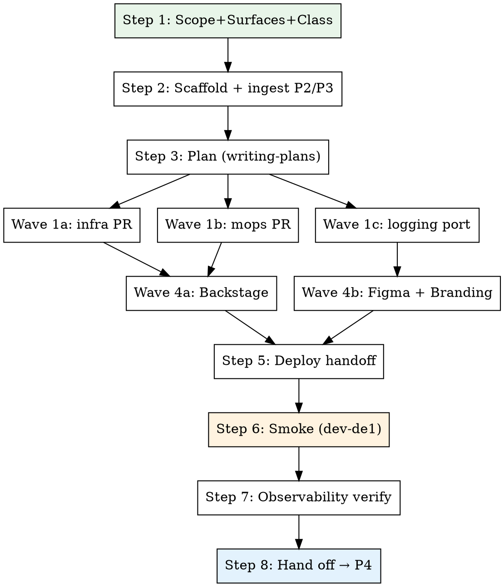

# P5 — Bootstrap Skill Refinement (umbrella) — Design

**Date:** 2026-05-23
**Author:** Max (`max@staffbase.com`)
**Status:** Draft for review

This spec is sub-plan P5 of the CC Custom Plugin Platform roadmap ([`../plans/2026-05-23-cc-custom-plugin-platform-roadmap.md`](../plans/2026-05-23-cc-custom-plugin-platform-roadmap.md)). It governs a consolidation pass over the existing bootstrap skill at [`cc-custom-plugin-template/.claude/skills/cc-custom-plugin-bootstrap/SKILL.md`](../../../.claude/skills/cc-custom-plugin-bootstrap/SKILL.md) — producing a v2 that absorbs the lessons from `cc-custom-plugin-glossary` v1.0.0 + `cc-custom-plugin-applaunchpad` PR #82, declares consumption points for P2/P3/P4 artifacts, and hardens the failure / secrets / smoke-test surface.

## Context

The bootstrap skill landed as an **initial, working-but-thin draft** during the cross-repo sync work (S1–S5, see [`2026-05-22-cross-repo-sync-design.md`](./2026-05-22-cross-repo-sync-design.md)). It captures the 4-wave orchestration shape, the MCP-first principle, and the canonical reference plugins — but it was never reviewed. P5 is its review pass: full rewrite where the structure is wrong, surgical edits where the structure holds, plus three new sibling guide docs.

P5 does **not** depend on P2/P3/P4 *implementations* — it depends on their specs being drafted, so the v2 frontmatter can declare consumption shape. P2 is being drafted in parallel; P3 + P4 specs are deferred. Where P5 references P3/P4 outputs, the skill carries `# TODO when P3/P4 spec lands` markers rather than blocking on them.

The v2 bootstrap skill is the orchestrator for the full customer-request → POC pipeline: it sits downstream of P2 (user-stories) and P3 (design-handoff) and upstream of P4 (feature-impl).

## Current state audit

What the existing skill does well — **keep**:

- 4-wave structure (Wave 1a infra, 1b mops, 1c logging instr, 4a Backstage, 4b Figma) — see SKILL.md lines 80–90. Crisp, parallelizable.
- MCP-first principle + the "First MCP, second `gh`, third browser, last manual" pattern (lines 144–151).
- Common MCP toolset table (lines 114–142) — comprehensive and accurate.
- Approval gates list (lines 155–166) — short, blunt, correctly scoped.
- "Do NOT use this skill for" framing (lines 16–20).
- Reference plugins paragraph (lines 170–175) — explicit canonical hierarchy.

Gaps — **refine or replace**:

- Step 1 questions are minimal (3 questions, lines 47–53). Misses branding, scale, GDPR class, push, multi-lang, customer-facing/internal.
- Step 4 wave table (lines 82–90) describes work in prose; not templated → drift between bootstraps.
- Step 5 (deployment handoff, lines 92–106) only links the glossary doc. No first-deployment MCP playbook embedded.
- No failure-recovery surface at all. The roadmap candidate `failure recovery` doesn't exist in v1.
- No secrets-handling decision tree. Implicit only.
- No smoke-test procedure canonical — referenced via glossary observability doc, but smoke ≠ observability verification.
- No slug-rename procedure. v1 says "renaming later is painful" (line 53) without offering an escape hatch.
- No branding/theming handoff step. Custom plugins all need colors/logo/copy injection; v1 omits it.
- No versioning / CHANGELOG / tag automation guidance.
- No frontmatter declaration of consumed artifacts (`docs/product/user-stories.md`, etc.).
- No reference-plugin promotion mechanism — glossary + applaunchpad are pinned, but no policy for when a new plugin overtakes them.

## Target shape — v2 outline

Section headers (in order):

1. **Header + frontmatter** — adds `consumes:` (P2/P3/P4 artifacts), `produces:` (cross-repo PRs, Vault paths, CuCu registration), `requires-skills:` block (writing-plans, subagent-driven-development, brainstorming, grill-me, cavecrew triad).
2. **Use this skill when / Do NOT use for** — retain v1.
3. **Process** — extended flow diagram (below).
4. **Step 1 — Scope, surfaces, classification** (was: Confirm scope + name) — grill-me-driven expansion to 9 questions.
5. **Step 2 — Scaffold** — adds `docs/product/user-stories.md` + `docs/design/component-map.md` ingest if present.
6. **Step 3 — Plan** — unchanged shape, retains writing-plans hand-off.
7. **Step 4 — Execute (templated waves)** — Wave 1a/1b/1c prompts as named templates, not prose.
8. **Step 5 — Deployment handoff** — embeds first-deployment MCP playbook.
9. **Step 6 — Smoke test (dev-de1)** — new dedicated step, links new canonical doc.
10. **Step 7 — Observability verify** — was v1 Step 6.
11. **Step 8 — Hand off to feature-impl (P4)** — new closing step.
12. **Failure recovery** — new section, links new guide.
13. **Secrets-handling decision tree** — new section, links new guide.
14. **Branding/theming** — new section.
15. **Versioning + CHANGELOG** — new section.
16. **Slug rename procedure** — new section.
17. **Common MCP toolset** — retain, surgical edits.
18. **Approval gates** — hardened (see below).
19. **Reference plugins + promotion policy** — extends v1 paragraph.



## Section-by-section design

| # | Candidate | Decision | Rationale |
|---|-----------|----------|-----------|
| 1 | Consume P2/P3/P4 artifacts | **Refine** | Add `consumes:` frontmatter + ingestion in Steps 1, 2, 8. Carry `# TODO when P3/P4 spec lands` for design + impl paths. |
| 2 | First-deployment MCP playbook | **Refine** | Embed as Step 5 sub-section: env→Grafana MCP table, Vault path safety rules, kobs as fallback, browser as last resort. Link to existing toolset table. |
| 3 | Failure recovery | **Replace** | New sibling guide [`cc-custom-plugin-template/docs/guides/failure-recovery.md`](../../guides/failure-recovery.md). Skill section is a 1-paragraph pointer + the recovery matrix (Vault-OK/VSO-fail, CuCu-OK/URL-wrong, mops-OK/image-late, per-wave rollback). |
| 4 | Secrets handling decision tree | **Replace** | New guide [`cc-custom-plugin-template/docs/guides/secrets-handling.md`](../../guides/secrets-handling.md). Flowchart: Vault for prod creds, env for build-time, K8s secret for runtime-non-rotating, CuCu config for tenant-visible. |
| 5 | Branding/theming | **Refine** | New Step 1 questions (colors, logo URL, copy strings) flow into `plugin.json` + `client/src/theme.ts` + widget manifest during Step 2 scaffold. |
| 6 | Versioning + CHANGELOG | **Refine** | New skill section; references template-sync `[sync]` tagging (see [`template-sync.md`](../../guides/template-sync.md)). v1.0.0 cut criterion: 7-step deploy-handoff complete in stage + 24h prod soak. |
| 7 | Dev-de1 smoke test | **Replace** | New guide [`cc-custom-plugin-template/docs/guides/smoke-test-dev-de1.md`](../../guides/smoke-test-dev-de1.md). Skill Step 6 becomes its invocation point. |
| 8 | Slug constraints + rename | **Refine** | New skill sub-section + canonical rename runbook embedded (Vault path rewrite, K8s namespace dance, DB rename, image retag, CuCu URL repoint). Two-paragraph escape hatch. |
| 9 | Step 1 question expansion | **Replace** | grill-me drives 9 questions, one at a time, each with a recommended answer. See worked example below. |
| 10 | Subagent task templates | **Replace** | Wave 1a/1b/1c prompts named + parameterised. Worked example for Wave 1b below. |
| 11 | Reference plugin tracking | **Refine** | Add "Promotion policy" sub-section: a plugin becomes canonical when (a) it ships v1.0.0+, (b) introduces a generic improvement template-sync'd back, (c) outpaces the current canonical on observability completeness. |

## Artifact consumption (P2/P3/P4)

Frontmatter additions:

```yaml
---
name: cc-custom-plugin-bootstrap
description: ...
consumes:
  - docs/product/user-stories.md     # produced by P2 cc-custom-plugin-user-stories
  - docs/design/component-map.md     # produced by P3 cc-custom-plugin-design-handoff  # TODO when P3 spec lands
produces:
  - cross-repo-prs: [Staffbase/infrastructure, Staffbase/mops, Staffbase/cc-custom-plugin-<slug>]
  - vault-paths: kv/cc-custom-plugin-<slug>/{dev-de1,stage-de1,prod-de1,prod-au1,prod-us1}/{db,encryption-key,api-tokens}
  - cucu-registration: per-env (5 envs)
hands-off-to:
  - cc-custom-plugin-feature-impl     # P4  # TODO when P4 spec lands
---
```

Ingestion points:

- **Step 1** — if `docs/product/user-stories.md` exists, parse it for surfaces + GDPR class + scale; pre-populate grill-me question recommendations.
- **Step 2** — after scaffold, if `docs/design/component-map.md` exists, copy referenced `@staffbase/design` components into `client/src/components/admin/` skeleton.
- **Step 8** — explicit hand-off invocation `Skill(cc-custom-plugin-feature-impl, args: ...)`.

## Subagent task templates

Convert Wave 1a/1b/1c prose into named templates with parameter blocks. Each template lives inline in SKILL.md under a `### Template — Wave Nx` heading.

**Worked example — Wave 1b mops PR template:**

```markdown
### Template — Wave 1b (mops PR)

**Subagent:** `caveman:cavecrew-builder`
**Reference:** `Staffbase/mops/clusters/<env>/cc-custom-plugin-glossary/`
**Inputs:** `{slug}`, `{owner-team}`, `{surfaces}` (admin|widget|both), `{envs}` (default: dev-de1, stage-de1, prod-de1, prod-au1, prod-us1)

**Goal:** Open one PR on `Staffbase/mops` adding `clusters/<env>/cc-custom-plugin-{slug}/` per env, plus a top-level `CODEOWNERS` line for `{owner-team}`.

**Steps:**
1. Branch `feat/cc-custom-plugin-{slug}-mops` off `main`.
2. For each env in `{envs}`: copy `clusters/{env}/cc-custom-plugin-glossary/` → `clusters/{env}/cc-custom-plugin-{slug}/`; substitute slug; null out glossary-specific overrides.
3. Append `CODEOWNERS` entry: `/clusters/*/cc-custom-plugin-{slug}/ @{owner-team}`.
4. Run `kubectl kustomize clusters/dev-de1/cc-custom-plugin-{slug}/` — must validate.
5. Open DRAFT PR, title `feat: bootstrap cc-custom-plugin-{slug}`, link body to bootstrap plan.

**Approval gate:** PR opens DRAFT — main thread (NOT subagent) flips to ready-for-review after Wave 1a infra PR lands.

**Reference port:** never invent. Always diff against `cc-custom-plugin-glossary` clusters dirs.
```

Wave 1a (infra) and Wave 1c (logging port) follow the same template shape — parameters, reference, steps, approval gate, reference-port rule.

## Approval gates

**Retain from v1:** `vault kv put`, `gh pr merge` on infra/mops main, prod `kubectl delete`, CuCu prod, tag cuts, any rename.

**Add:**

- **Slug rename** — explicit gate even outside prod. Cross-references the new rename guide.
- **CuCu URL repoint** — separate from "CuCu changes in prod" because URL repoints affect tenant traffic instantly.
- **Promotion of a plugin to canonical** — requires user confirmation; never auto-promote.

**Harden:**

- The v1 list does not enforce DRAFT status on opening PRs. Add: "All cross-repo PRs open DRAFT, flipped to ready-for-review only after preview verifies." Mirrors `template-sync.md` discipline.

## Failure recovery, secrets, smoke test — new guide docs

Each gets a sibling guide, linked from SKILL.md but not embedded:

- [`cc-custom-plugin-template/docs/guides/failure-recovery.md`](../../guides/failure-recovery.md) — recovery matrix per partial-failure state (Vault/VSO/CuCu/mops/image), rollback procedure per wave, "stop and ask" thresholds.
- [`cc-custom-plugin-template/docs/guides/secrets-handling.md`](../../guides/secrets-handling.md) — decision tree (Vault / env / K8s secret / CuCu config), with worked examples from glossary.
- [`cc-custom-plugin-template/docs/guides/smoke-test-dev-de1.md`](../../guides/smoke-test-dev-de1.md) — canonical 20-min walkthrough: pod ready, plugin loads, one read, one write, structured log present in Victoria Logs, metric present in Grafana dev-de1, push delivers (if push surface), accessor revalidation fires on synthetic expiry.

Skill body links each — does not duplicate.

## Acceptance criteria

1. SKILL.md v2 ships with `consumes:` + `produces:` + `hands-off-to:` frontmatter; `# TODO when P3/P4 spec lands` markers present where unavoidable.
2. Step 1 question count expanded from 3 to 9 and driven by grill-me (one-at-a-time + recommended answer per question).
3. Wave 1a / 1b / 1c prompts present as named templates with parameter blocks — no prose-only wave descriptions remain.
4. Sibling guides referenced from SKILL.md as-needed (roadmap marks these as "possibly new" — author only those whose absence blocks SKILL.md v2 from passing acceptance #5): `failure-recovery.md`, `secrets-handling.md`, `smoke-test-dev-de1.md`. Decision recorded in the implementation plan, not here.
5. Skill executes end-to-end on a test slug (e.g. `cc-custom-plugin-test-bootstrap`) without main thread needing to recover from a v1-only gap (failure recovery, secrets ambiguity, missing smoke procedure, slug rename).
6. Approval gates list extended with slug-rename, CuCu URL repoint, promotion-to-canonical; DRAFT discipline made explicit.
7. Reference plugins section includes promotion policy.
8. `mkdocs build --strict` passes; all new guides cross-link cleanly.

## Open questions (with recommended answers)

- **How do we test the skill itself?** *Recommend:* dry-run on a throwaway slug (`cc-custom-plugin-bootstrap-test-YYYYMMDD`) targeting dev-de1 only, with `DRY_RUN=1` flags on `vault kv put` + no real CuCu register. Discard the dry-run repo after.
- **Should grill-me drive Step 1?** *Recommend:* yes — Step 1 is the highest-stakes question phase, exactly grill-me's wheelhouse. Vendor dependency already in template (per roadmap A1).
- **Manual invocation (`/cc-custom-plugin-bootstrap`) or auto-trigger on repo creation?** *Recommend:* manual for v2; auto-trigger waits for template GitHub Action that detects new `cc-custom-plugin-*` repo creation (post-P5).
- **When to retire v1?** *Recommend:* after first successful v2 bootstrap (audio-hub, when its impl phase starts) — not N=many, the first real run is the smoke test.

## Implementation plan pointer

Implementation plan lives at [`cc-custom-plugin-template/docs/superpowers/plans/2026-05-23-P5-bootstrap-skill-refinement-plan.md`](../plans/2026-05-23-P5-bootstrap-skill-refinement-plan.md).
